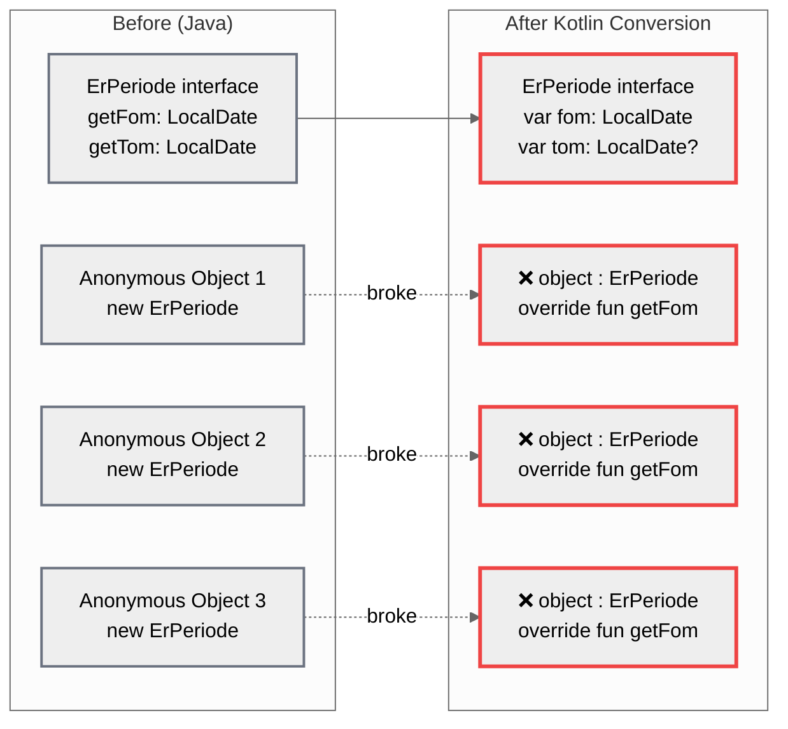
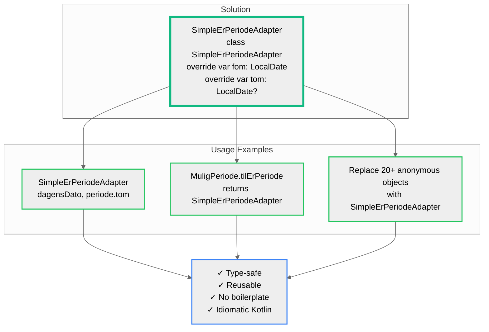
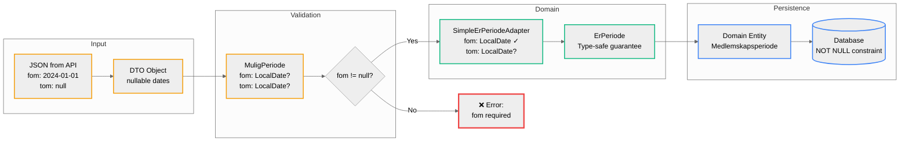
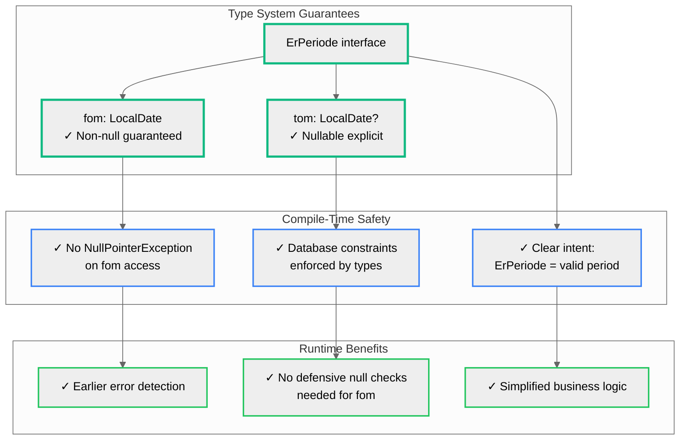

# ErPeriode Kotlin-konvertering - Two-Tier Period Architecture

## Sammendrag

**Problem:**
- ErPeriode-interface konvertert til Kotlin med `fom: LocalDate` (non-null)
- Gir type-sikkerhet, men utfordringer ved konvertering fra DTOs/JSON med nullable datoer
- Databasen krever `@Column(nullable = false)` på fom for alle periode-entiteter
- Anonyme objekter brukte Java-stil getters som ikke fungerer med Kotlin properties

**Løsning - To-lags arkitektur:**

1. **MuligPeriode** (Transport/DTO-lag)
   - `fom: LocalDate?` og `tom: LocalDate?` (begge nullable)
   - Brukes for JSON, eksterne APIer, uvaliderte data
   - Konverteringsmetoder:
     - `tilErPeriode()` → `ErPeriode?` (returnerer null hvis fom mangler)
     - `hentErPeriode()` → `ErPeriode` (kaster exception hvis fom mangler)

2. **ErPeriode** (Domene/Persistens-lag)
   - `fom: LocalDate` (non-null) og `tom: LocalDate?`
   - Brukes for domene-entiteter, forretningslogikk, database-lagring
   - Type-systemet garanterer at fom alltid er tilstede

3. **SimpleErPeriodeAdapter**
   - Konkret implementasjon av ErPeriode
   - Erstatter anonyme objekter: `object : ErPeriode { ... }`
   - Enkel bruk: `SimpleErPeriodeAdapter(fomDate, tomDate)`

**Fordeler:**
- Type-sikkerhet: Hvis du har `ErPeriode`, vet du at `fom` er non-null
- Tydelig separasjon mellom validert (ErPeriode) og uvalidert (MuligPeriode) data
- Tryggere database-operasjoner
- Idiomatisk Kotlin-kode uten boilerplate

---

## 1. Two-Tier Period Architecture

```mermaid
%%{init: {'theme':'base', 'themeVariables': { 'primaryColor':'#ffcc00','primaryTextColor':'#000','primaryBorderColor':'#ff9900','lineColor':'#666','secondaryColor':'#90EE90','tertiaryColor':'#ADD8E6'}}}%%
graph TB
    subgraph "Transport Layer (DTO/JSON)"
        MP[MuligPeriode<br/>fom: LocalDate?<br/>tom: LocalDate?]
    end

    subgraph "Domain/Persistence Layer (Database)"
        EP[ErPeriode<br/>fom: LocalDate ✓<br/>tom: LocalDate?]
        DB[(Database<br/>@Column nullable=false)]
    end

    MP -->|tilErPeriode| EP
    MP -->|hentErPeriode| EP

    JSON[External APIs<br/>JSON/DTOs] --> MP
    UI[Frontend] --> MP

    EP --> Integration[Integration<br/>JSON to external parties]
    EP --> Entities[Domain Entities<br/>Medlemskapsperiode<br/>Lovvalgsperiode]
    Entities --> DB

    classDef transportClass stroke:#f59e0b,stroke-width:3px
    classDef domainClass stroke:#10b981,stroke-width:3px
    classDef dbClass stroke:#3b82f6,stroke-width:3px

    class MP transportClass
    class EP domainClass
    class DB,Entities dbClass
```

**Forklaring:**
- **Transport Layer**: Håndterer data fra eksterne kilder hvor datoer kan mangle
- **Domain Layer**: Garanterer at fom alltid er tilstede før data brukes i forretningslogikk
- **Konvertering**: Eksplisitt validering ved overgang mellom lagene

---

## 2. The Problem: Anonymous Objects Before Kotlin Conversion



**Problemet:**
- I Java hadde ErPeriode getter-metoder: `getFom()`, `getTom()`
- Anonyme objekter implementerte disse metodene
- Ved konvertering til Kotlin ble interface endret til properties: `var fom`, `var tom`
- Anonyme objekter med `override fun getFom()` kompilerer ikke lenger
- Løsningen er å bruke `SimpleErPeriodeAdapter` i stedet

**Eksempel på feil:**
```kotlin
// ❌ Fungerer ikke lenger:
object : ErPeriode {
    override fun getFom(): LocalDate = dagensDato.withDayOfYear(1)
    override fun getTom(): LocalDate? = periode.tom
}

// ✅ Riktig løsning:
SimpleErPeriodeAdapter(dagensDato.withDayOfYear(1), periode.tom)
```

---

## 3. The Solution: SimpleErPeriodeAdapter



**SimpleErPeriodeAdapter implementasjon:**
```kotlin
class SimpleErPeriodeAdapter(
    override var fom: LocalDate,
    override var tom: LocalDate?
) : ErPeriode
```

**Bruksområder:**
1. Direkte instansiering når man trenger en ErPeriode
2. Intern implementasjon i `MuligPeriode.tilErPeriode()`
3. Erstatter alle anonyme ErPeriode-objekter i kodebasen

---

## 4. Conversion Flow



**Flyten:**
1. **Input**: Data kommer fra eksterne kilder (JSON, APIer)
2. **Validation**: `MuligPeriode` sjekker om `fom` er tilstede
3. **Conversion**: Hvis valid, opprett `SimpleErPeriodeAdapter`
4. **Domain**: Brukes som `ErPeriode` i forretningslogikk
5. **Persistence**: Lagres i database med NOT NULL constraint på fom

**Kodeeksempel:**
```kotlin
// Fra JSON til MuligPeriode
val dto: PeriodeDTO = fromJson(...)
val muligPeriode: MuligPeriode = dto

// Validering og konvertering
val erPeriode: ErPeriode = muligPeriode.hentErPeriode() // kaster exception hvis fom == null
// eller
val erPeriode: ErPeriode? = muligPeriode.tilErPeriode() // returnerer null hvis fom == null

// Bruk i domene
medlemskapsperiode.periode = erPeriode
```

---

## 5. Type Safety Benefits



**Type-sikkerhetsfordeler:**

### Compile-Time (kompileringstid):
- **Ingen NPE på fom**: Kompilatoren garanterer at `fom` aldri er null
- **Database constraints**: Typesystemet matcher database-constraints
- **Klar intensjon**: `ErPeriode` betyr alltid en gyldig periode med fom

### Runtime (kjøretid):
- **Tidligere feiloppdagelse**: Feil oppdages ved validering, ikke når data brukes
- **Ingen defensive sjekker**: Slipper `if (periode.fom != null)` i forretningslogikk
- **Enklere kode**: Mindre boilerplate, tydeligere intensjon

**Kodesammenligning:**
```kotlin
// ❌ Med nullable fom (må sjekke overalt):
fun beregnTrygdeavgift(periode: MuligPeriode) {
    if (periode.fom == null) {
        throw IllegalArgumentException("fom er påkrevd")
    }
    val fom = periode.fom!! // unsafe, men nødvendig
    // ... resten av logikken
}

// ✅ Med ErPeriode (type-sikker):
fun beregnTrygdeavgift(periode: ErPeriode) {
    val fom = periode.fom // alltid safe, garantert non-null
    // ... resten av logikken
}
```

---

## Implementerte Endringer

### 1. Ny klasse: SimpleErPeriodeAdapter
```kotlin
// domain/src/main/kotlin/no/nav/melosys/domain/SimpleErPeriodeAdapter.kt
class SimpleErPeriodeAdapter(
    override var fom: LocalDate,
    override var tom: LocalDate?
) : ErPeriode
```

### 2. Oppdatert MuligPeriode interface
```kotlin
interface MuligPeriode {
    val fom: LocalDate?
    val tom: LocalDate?

    fun tilErPeriode(): ErPeriode? = fom?.let { fomDate ->
        SimpleErPeriodeAdapter(fomDate, tom)
    }

    fun hentErPeriode(): ErPeriode = tilErPeriode()
        ?: error("Kan ikke opprette ErPeriode: fom-dato er påkrevd men er null")
}
```

### 3. Erstattet anonyme objekter
**Før:**
```kotlin
val periode = object : ErPeriode {
    override fun getFom(): LocalDate = dagensDato.withDayOfYear(1)
    override fun getTom(): LocalDate? = periode.tom
}
```

**Etter:**
```kotlin
val periode = SimpleErPeriodeAdapter(dagensDato.withDayOfYear(1), periode.tom)
```

### 4. Eksempler fra kodebasen
- `TrygdeavgiftsberegningValidator.kt`: Erstattet anonyme ErPeriode-objekter
- `MuligPeriode.kt`: Bruker SimpleErPeriodeAdapter i konverteringsmetoder
- 20+ andre steder i kodebasen

---

## Konklusjon

Løsningen gir:
1. ✅ **Type-sikkerhet**: Kompilator garanterer at fom er non-null
2. ✅ **Enklere kode**: Mindre boilerplate, tydeligere intensjon
3. ✅ **Database-sikkerhet**: Type-system matcher database-constraints
4. ✅ **Bedre feilhåndtering**: Feil oppdages tidlig ved validering
5. ✅ **Idiomatisk Kotlin**: Properties i stedet for getters
6. ✅ **Tydelig arkitektur**: Klar separasjon mellom transport- og domene-lag
