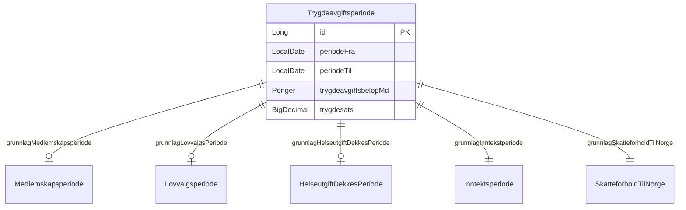
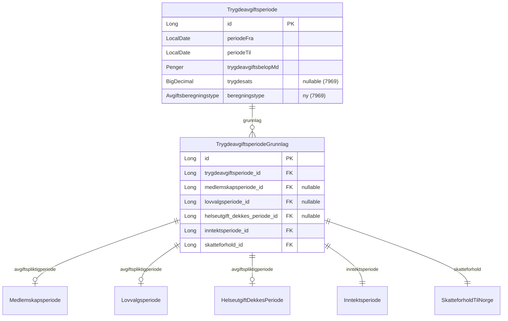
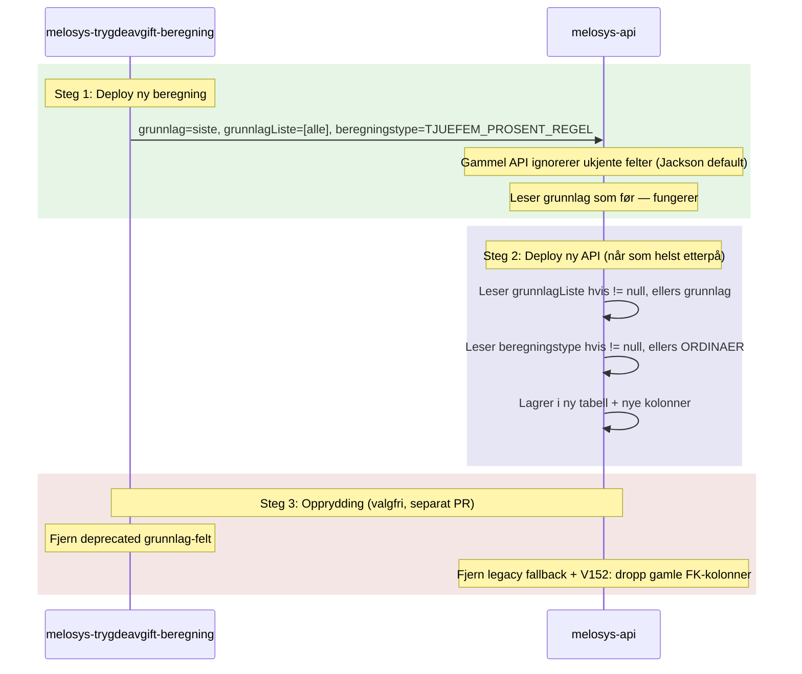
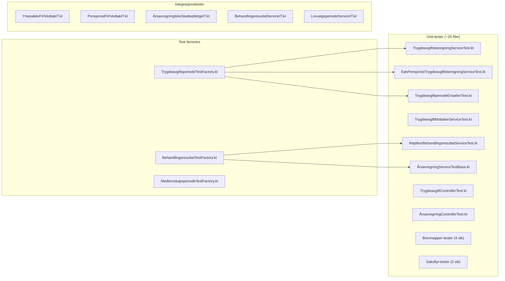
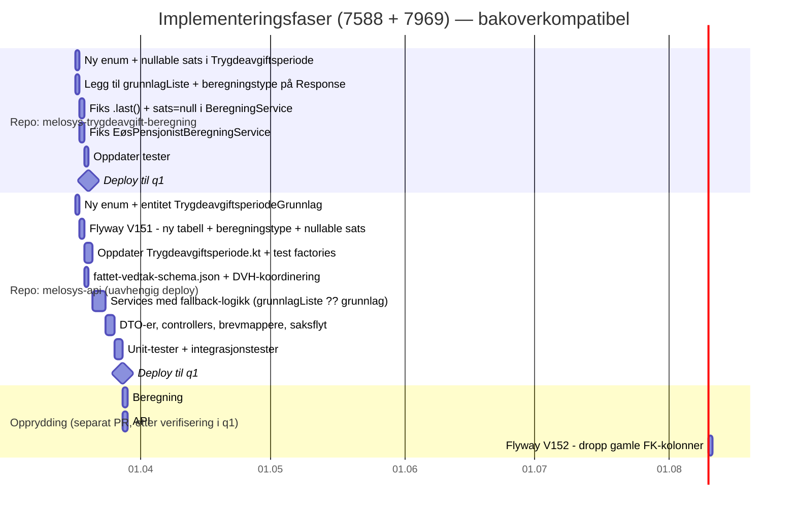

# MELOSYS-7588 + MELOSYS-7969: Utvid datamodell for trygdeavgiftsperioder

**Dato:** 2026-03-17 (oppdatert)
**Oppgaver:**
- [MELOSYS-7588](https://jira.adeo.no/browse/MELOSYS-7588) — Utvid datamodell til å støtte flere grunnlagsperioder
- [MELOSYS-7969](https://jira.adeo.no/browse/MELOSYS-7969) — Lagre beregningstype (25%-regel/minstebeløp) og gjør sats nullable

**Epic:** [MELOSYS-7464](https://jira.adeo.no/browse/MELOSYS-7464) — Støtte til 25%-regelen og minstebeløpet
**Teknisk analyse:** [MELOSYS-7557](https://jira.adeo.no/browse/MELOSYS-7557)
**Confluence:** [Eksempler på fastsettelse av trygdeavgift](https://confluence.adeo.no/spaces/TEESSI/pages/535938349) | [25%-regelen](https://confluence.adeo.no/spaces/TEESSI/pages/704156896) | [Fysisk DB-modell](https://confluence.adeo.no/spaces/TEESSI/pages/603722350)

> **Hvorfor slått sammen?** Begge oppgavene endrer nøyaktig de samme filene på nøyaktig de samme stedene
> (API-kontrakten, `.last()`-metodene, entiteten, DTO-ene, brevmapperne). Å gjøre dem separat ville
> betydd to API-kontraktendringer, to deploy-koordineringer, og dobbel omskriving av alle tester.

---

## 1. Problemet

### Dagens modell (1:1)

Hver `Trygdeavgiftsperiode` har **nøyaktig ett** grunnlag — fem FK-felter der kun ett av de tre avgiftspliktig-typene er satt:



**Begrensning i kode:**
- `Trygdeavgiftsperiode.addGrunnlag()` (linje 110-127) kaster error ved mer enn ett grunnlag: `"Trygdeavgiftsperiode har allerede et grunnlag satt. Kan ikke ha flere grunnlag samtidig."`
- `BeregningService.kt` i `melosys-trygdeavgift-beregning` bruker `.last()` på 3 steder + 1 i `EøsPensjonistBeregningService.kt` — kun siste grunnlag bevares når 25%-regelen slår inn

### Manglende metadata om beregningstype (7969)

I tillegg til grunnlag-problemet, mangler det informasjon om **hvilken beregningsregel** som ble brukt:

1. **Ingen indikator på 25%-regel vs ordinær beregning** — verken i API-responsen fra `melosys-trygdeavgift-beregning` eller i `Trygdeavgiftsperiode`-entiteten. Saksbehandler og brev kan ikke se *hvorfor* en periode har den satsen den har.
2. **Sats `0.00` brukes som proxy** — de 4 `.last()`-stedene setter `sats = BigDecimal.ZERO.setScale(2)` for begrensede perioder. Men `0%` er feil — 25%-regelen bruker ingen sats, den beregner et totalbeløp. Sats bør være `null`.
3. **Brevmappere sjekker `trygdesats == BigDecimal.ZERO`** — `InnvilgelseFtrlMapper.kt` (linje 299-314) og `InformasjonTrygdeavgiftMapper.kt` (linje 71-96) bruker dette for å avgjøre om avgiftsperioder skal vises. Med nullable sats må denne logikken oppdateres.

### Hva 25%-regelen krever

Når 25%-regelen gir gunstigere beregning, erstattes **flere** ordinære trygdeavgiftsperioder med **én** samlet periode (se [Confluence-eksemplene](https://confluence.adeo.no/spaces/TEESSI/pages/535938349)).

Fra MELOSYS-7557: *"En 'lang' trygdeavgiftsperiode med beløpet fra 25%-regelen erstatter mindre trygdeavgiftsperioder når totalbeløpet for året overstiger grensen."*

**Eksempel (Confluence Eksempel 2):** En frivillig medlem med utenlandsk inntekt 20 000→25 000 kr/mnd og næringsinntekt 10 000 kr/mnd. Pensjonsdelen beregnes etter 25%-regelen og gir **én** samlet trygdeavgiftsperiode som baserer seg på **5 underliggende inntektsperioder med ulik sats og beløp**.

Denne ene perioden trenger altså å referere **alle** de opprinnelige grunnlagene — ikke bare det siste.

---

## 2. Målbilde (1:N)



**Merk:** Navnet `TrygdeavgiftsperiodeGrunnlag` er valgt for å unngå navnekollisjon med `AvgiftsperiodeGrunnlag` som allerede eksisterer i `melosys-trygdeavgift-beregning`.

### Ny enum: `Avgiftsberegningstype` (7969)

```kotlin
enum class Avgiftsberegningstype {
    ORDINAER,              // Vanlig satsberegning
    TJUEFEM_PROSENT_REGEL, // 25%-regel ga gunstigere beregning
    MINSTEBELOEP           // Inntekt under minstebeløpet → ingen avgift
}
```

---

## 3. Bakoverkompatibel deploy-strategi

### Prinsipp: Nye felter legges til — gamle felter beholdes

I stedet for å **erstatte** `grunnlag`-feltet (breaking change), legges nye felter til **ved siden av** de eksisterende. Dette gjør at repoene kan deployes i **vilkårlig rekkefølge** uten nedetid.

### API-kontrakt (melosys-trygdeavgift-beregning → melosys-api)

```kotlin
// BeregnetTrygdeavgiftResponse.kt — bakoverkompatibel versjon
data class BeregnetTrygdeavgiftResponse(
    val beregnetPeriode: Trygdeavgiftsperiode,
    val grunnlag: AvgiftsperiodeGrunnlag,                    // BEHOLDES — alltid siste/eneste
    val grunnlagListe: List<AvgiftsperiodeGrunnlag>? = null, // NYTT — null = bruk grunnlag
    val beregningstype: Avgiftsberegningstype? = null        // NYTT — null = ORDINAER
)
```

### Database (melosys-api)

Samme prinsipp — nye strukturer legges til, gamle beholdes under overgangsperioden:
- **V151:** Ny `trygdeavgiftsperiode_grunnlag`-tabell + `beregningstype`-kolonne + nullable sats
- Koden leser fra ny tabell, faller tilbake til gamle FK-er
- **V152:** Dropp gamle FK-kolonner (etter at alt fungerer)

### Deploy-sekvens



**Fordeler:**
- Ingen koordinert deploy — repoene er uavhengige
- Rollback er trygt i begge retninger
- Kan verifisere i q1 før opprydding

### Kompatibilitetsmatrise

| melosys-trygdeavgift-beregning | melosys-api | Resultat |
|-------------------------------|-------------|----------|
| Gammel | Gammel | Fungerer som i dag |
| **Ny** | Gammel | Gammel API ignorerer `grunnlagListe`/`beregningstype`, leser `grunnlag` |
| Gammel | **Ny** | `grunnlagListe` er null → fallback til `grunnlag`. `beregningstype` er null → `ORDINAER` |
| **Ny** | **Ny** | Full funksjonalitet — alle grunnlag + beregningstype lagres |

---

## 4. Detaljert endringsplan

### Fase 1: melosys-trygdeavgift-beregning — API-kontraktendring

#### Filer som endres

| Fil | Endring (7588) | Endring (7969) |
|-----|----------------|----------------|
| `modell/felles/Trygdeavgiftsperiode.kt` | — | `sats: BigDecimal` → `sats: BigDecimal?` (nullable) |
| `modell/felles/Avgiftsberegningstype.kt` | — | **Ny enum:** `ORDINAER`, `TJUEFEM_PROSENT_REGEL`, `MINSTEBELOEP` |
| `standard/modell/BeregnetTrygdeavgiftResponse.kt` | Behold `grunnlag`, legg til `grunnlagListe: List<...>?` | Legg til `beregningstype: Avgiftsberegningstype?` |
| `standard/modell/AvgiftsperiodeGrunnlag.kt` | Uendret (brukes fortsatt for enkeltelement) | — |
| `standard/BeregningService.kt` | 3 steder: `.last()` → pass hele listen | 3 steder: `sats = BigDecimal.ZERO.setScale(2)` → `sats = null` + sett beregningstype |
| `eospensjonist/modell/EøsPensjonistBeregnetTrygdeavgiftResponse.kt` | Behold `grunnlag`, legg til `grunnlagListe: List<...>?` | Legg til `beregningstype: Avgiftsberegningstype?` |
| `eospensjonist/EøsPensjonistBeregningService.kt` | 1 sted: `.last()` → pass hele listen | 1 sted: `sats = null` + beregningstype |
| Berørte tester | Alle tester som konstruerer `BeregnetTrygdeavgiftResponse` | Tester som asserted `sats shouldBe BigDecimal.ZERO` → `sats shouldBe null` |

#### Detalj: Endringer i de 4 begrensningsmetodene (7588 + 7969 kombinert)

Hver av de 4 metodene har **to** problemer som fikses samtidig:

**1. `opprettBegrensetAvgiftResponse` (pliktig, linje 368-377)**
```kotlin
// FØR:
BeregnetTrygdeavgiftResponse(
    Trygdeavgiftsperiode(periode = samletPeriode, sats = BigDecimal.ZERO.setScale(2), ...),
    AvgiftsperiodeGrunnlag(grunnlagPerioder.last())
)
// ETTER (bakoverkompatibel):
BeregnetTrygdeavgiftResponse(
    Trygdeavgiftsperiode(periode = samletPeriode, sats = null, ...),
    grunnlag = AvgiftsperiodeGrunnlag(grunnlagPerioder.last()),          // beholdes for gammel API
    grunnlagListe = grunnlagPerioder.map { AvgiftsperiodeGrunnlag(it) }, // 7588: alle grunnlag
    beregningstype = Avgiftsberegningstype.TJUEFEM_PROSENT_REGEL        // 7969: eksplisitt type
)
```

**2. `opprettBegrensetResponse` (frivillig helse/pensjon, linje 267-276)**
```kotlin
// FØR:
opprettBegrensetAvgiftResponseForPeriode(..., grunnlagPeriode = avgiftsgrunnlagPerioder.last())
// ETTER:
opprettBegrensetAvgiftResponseForPeriode(..., grunnlagPerioder = avgiftsgrunnlagPerioder)
// + sats = null, beregningstype = TJUEFEM_PROSENT_REGEL
```

**3. `opprettMisjonærBegrensetAvgiftResponse` (misjonær, linje 132-147)**
```kotlin
// FØR:
grunnlagPeriode = periodeberegninger.last().grunnlagPeriode
// ETTER:
grunnlagPerioder = periodeberegninger.map { it.grunnlagPeriode }
// + sats = null, beregningstype = TJUEFEM_PROSENT_REGEL
```

**4. `EøsPensjonistBeregningService.opprettBegrensetAvgiftResponse` (linje 85-96)**
```kotlin
// Samme mønster — .last() → .map { ... }, sats = null, beregningstype
```

**Minstebeløp-tilfellet** (inntekt under minstebeløpet → ingen avgift):
Trenger også `beregningstype = MINSTEBELOEP` med `sats = null` og `månedsavgift = 0`.
Sjekk om dette håndteres i beregningsservicen allerede eller om det bare filtreres bort.

#### Ny JSON-kontrakt (respons — bakoverkompatibel)

**Ordinær beregning** (ingen endring for gammel API):
```json
{
  "beregnetPeriode": {
    "periode": { "fom": "2025-05-01", "tom": "2025-08-31" },
    "sats": 7.7,
    "månedsavgift": { "verdi": 1540, "valuta": { "kode": "NOK", "desimaler": 2 } }
  },
  "grunnlag": { "medlemskapsperiodeId": "uuid-1", "skatteforholdsperiodeId": "uuid-a", "inntektsperiodeId": "uuid-x" },
  "grunnlagListe": null,
  "beregningstype": null
}
```

**25%-regel** (gammel API ignorerer nye felter, leser `grunnlag` som før):
```json
{
  "beregnetPeriode": {
    "periode": { "fom": "2025-05-01", "tom": "2025-12-31" },
    "sats": null,
    "månedsavgift": { "verdi": 3448, "valuta": { "kode": "NOK", "desimaler": 2 } }
  },
  "grunnlag": { "medlemskapsperiodeId": "uuid-1", "skatteforholdsperiodeId": "uuid-b", "inntektsperiodeId": "uuid-y" },
  "grunnlagListe": [
    { "medlemskapsperiodeId": "uuid-1", "skatteforholdsperiodeId": "uuid-a", "inntektsperiodeId": "uuid-x" },
    { "medlemskapsperiodeId": "uuid-1", "skatteforholdsperiodeId": "uuid-b", "inntektsperiodeId": "uuid-y" }
  ],
  "beregningstype": "TJUEFEM_PROSENT_REGEL"
}
```

**Kontrakt-endringer oppsummert:**
- `grunnlag`: **uendret** — beholdes som enkelt-objekt (siste/eneste grunnlag)
- `grunnlagListe`: **nytt felt** — `List<AvgiftsperiodeGrunnlag>?` (null = bruk `grunnlag`)
- `sats`: `number` → `number | null` (null ved 25%-regel og minstebeløp)
- `beregningstype`: **nytt felt** — `Avgiftsberegningstype?` (null = `ORDINAER`)

**Mottaker-logikk i melosys-api:**
```kotlin
// TrygdeavgiftsberegningService.lagTrygdeavgiftsperiode()
val alleGrunnlag = response.grunnlagListe       // ny API: bruk listen
    ?: listOf(response.grunnlag)                // gammel API: wrap enkeltobjekt
val beregningstype = response.beregningstype
    ?: Avgiftsberegningstype.ORDINAER           // gammel API: default
```

---

### Fase 2: melosys-api — Ny entitet og Flyway-migrasjon

#### Ny entitet: `TrygdeavgiftsperiodeGrunnlag.kt`

**Plassering:** `domain/src/main/kotlin/no/nav/melosys/domain/avgift/TrygdeavgiftsperiodeGrunnlag.kt`

```kotlin
@Entity
@Table(name = "trygdeavgiftsperiode_grunnlag")
class TrygdeavgiftsperiodeGrunnlag(
    @Id
    @GeneratedValue(strategy = GenerationType.IDENTITY)
    var id: Long? = null,

    @ManyToOne(fetch = FetchType.LAZY)
    @JoinColumn(name = "trygdeavgiftsperiode_id", nullable = false)
    var trygdeavgiftsperiode: Trygdeavgiftsperiode,

    @ManyToOne
    @JoinColumn(name = "medlemskapsperiode_id")
    var medlemskapsperiode: Medlemskapsperiode? = null,

    @ManyToOne
    @JoinColumn(name = "lovvalgsperiode_id")
    var lovvalgsperiode: Lovvalgsperiode? = null,

    @ManyToOne
    @JoinColumn(name = "helseutgift_dekkes_periode_id")
    var helseutgiftDekkesPeriode: HelseutgiftDekkesPeriode? = null,

    @ManyToOne(cascade = [CascadeType.ALL])
    @JoinColumn(name = "inntektsperiode_id")
    val inntektsperiode: Inntektsperiode,

    @ManyToOne(cascade = [CascadeType.ALL])
    @JoinColumn(name = "skatteforhold_id")
    val skatteforhold: SkatteforholdTilNorge,
)
```

#### Flyway-migrasjon: `V151__trygdeavgiftsperiode_grunnlag_og_beregningstype.sql`

```sql
-- 1. Ny grunnlag-tabell (7588)
CREATE TABLE trygdeavgiftsperiode_grunnlag (
    id                          NUMBER GENERATED BY DEFAULT AS IDENTITY PRIMARY KEY,
    trygdeavgiftsperiode_id     NUMBER NOT NULL,
    medlemskapsperiode_id       NUMBER,
    lovvalgsperiode_id          NUMBER,
    helseutgift_dekkes_periode_id NUMBER,
    inntektsperiode_id          NUMBER NOT NULL,
    skatteforhold_id            NUMBER NOT NULL,
    CONSTRAINT fk_tag_trygdeavgiftsperiode FOREIGN KEY (trygdeavgiftsperiode_id)
        REFERENCES trygdeavgiftsperiode(id),
    CONSTRAINT fk_tag_medlemskapsperiode FOREIGN KEY (medlemskapsperiode_id)
        REFERENCES medlemskapsperiode(id),
    CONSTRAINT fk_tag_lovvalgsperiode FOREIGN KEY (lovvalgsperiode_id)
        REFERENCES lovvalgsperiode(id),
    CONSTRAINT fk_tag_helseutgift FOREIGN KEY (helseutgift_dekkes_periode_id)
        REFERENCES helseutgift_dekkes_periode(id),
    CONSTRAINT fk_tag_inntektsperiode FOREIGN KEY (inntektsperiode_id)
        REFERENCES inntektsperiode(id),
    CONSTRAINT fk_tag_skatteforhold FOREIGN KEY (skatteforhold_id)
        REFERENCES skatteforhold_til_norge(id)
);

-- Indeks på FK for JPA lazy loading ytelse (unngår full table scan)
CREATE INDEX idx_tag_trygdeavgiftsperiode ON trygdeavgiftsperiode_grunnlag(trygdeavgiftsperiode_id);

-- 2. Migrer eksisterende grunnlag-data (7588)
INSERT INTO trygdeavgiftsperiode_grunnlag
    (trygdeavgiftsperiode_id, medlemskapsperiode_id, lovvalgsperiode_id,
     helseutgift_dekkes_periode_id, inntektsperiode_id, skatteforhold_id)
SELECT
    t.id, t.medlemskapsperiode_id, t.lovvalg_periode_id,
    t.helseutgift_dekkes_periode_id, t.inntektsperiode_id, t.skatteforhold_id
FROM trygdeavgiftsperiode t
WHERE t.inntektsperiode_id IS NOT NULL
  AND t.skatteforhold_id IS NOT NULL;

-- 3. Ny kolonne for beregningstype (7969)
ALTER TABLE trygdeavgiftsperiode ADD beregningstype VARCHAR2(50);

-- 4. Sett default beregningstype for eksisterende data (7969)
UPDATE trygdeavgiftsperiode SET beregningstype = 'ORDINAER';

-- 5. Gjør trygdesats nullable (7969)
-- I dag: "trygdesats NUMBER NOT NULL" — 25%-regel og minstebeløp har ingen sats
ALTER TABLE trygdeavgiftsperiode MODIFY trygdesats NULL;
```

**Separat migrasjon `V152__fjern_gamle_grunnlag_fk.sql`** (etter at all kode er oppdatert og deployet):
```sql
ALTER TABLE trygdeavgiftsperiode DROP COLUMN inntektsperiode_id;
ALTER TABLE trygdeavgiftsperiode DROP COLUMN skatteforhold_id;
ALTER TABLE trygdeavgiftsperiode DROP COLUMN medlemskapsperiode_id;
ALTER TABLE trygdeavgiftsperiode DROP COLUMN lovvalg_periode_id;
ALTER TABLE trygdeavgiftsperiode DROP COLUMN helseutgift_dekkes_periode_id;
```

---

### Fase 3: melosys-api — Oppdater Trygdeavgiftsperiode-entiteten

#### Endring i `Trygdeavgiftsperiode.kt`

**Fjernes (7588):**
- De 5 FK-feltene (`grunnlagMedlemskapsperiode`, `grunnlagLovvalgsPeriode`, `grunnlagHelseutgiftDekkesPeriode`, `grunnlagInntekstperiode`, `grunnlagSkatteforholdTilNorge`)
- `addGrunnlag()`-metoden
- Getter-metodene `hentGrunnlagMedlemskapsperiode()`, `hentGrunnlagInntekstperiode()`, `hentGrunnlagSkatteforholdTilNorge()`

**Endres (7969):**
```kotlin
// FØR:
@Column(name = "trygdesats", nullable = false)
val trygdesats: BigDecimal,

// ETTER:
@Column(name = "trygdesats")
val trygdesats: BigDecimal?,           // nullable — null ved 25%-regel/minstebeløp

@Column(name = "beregningstype")
@Enumerated(EnumType.STRING)
val beregningstype: Avgiftsberegningstype = Avgiftsberegningstype.ORDINAER,
```

**Legges til (7588):**
```kotlin
@OneToMany(mappedBy = "trygdeavgiftsperiode", cascade = [CascadeType.ALL], orphanRemoval = true)
val grunnlag: MutableList<TrygdeavgiftsperiodeGrunnlag> = mutableListOf()
```

**Nye hjelpemetoder:**
```kotlin
fun hentGrunnlagAvgiftsperiode(): AvgiftspliktigPeriode =
    grunnlag.firstOrNull()?.hentAvgiftspliktigperiode()
        ?: error("Ingen grunnlag på trygdeavgiftsperiode")

fun hentAlleGrunnlag(): List<TrygdeavgiftsperiodeGrunnlag> = grunnlag.toList()

fun leggTilGrunnlag(g: TrygdeavgiftsperiodeGrunnlag) {
    g.trygdeavgiftsperiode = this
    grunnlag.add(g)
}

fun erBegrenset(): Boolean = beregningstype != Avgiftsberegningstype.ORDINAER
```

**Oppdateres:**
- `copyEntity()` — kopierer grunnlag-listen + beregningstype
- `erLikForSatsendring()` — **dobbel endring:** (1) nullable sats-sammenligning: `.compareTo()` → `==` (Kotlin null-safe), (2) erstatt 5 FK-felt-sammenligninger med sammenligning av grunnlag-listen + beregningstype
- `harAvgift()` — `trygdesats` er nå nullable. **OBS:** 25%-regel-perioder har `sats = null` men **positivt beløp** — de *har* avgift. Ny logikk: `BigDecimal.ZERO.compareTo(trygdeavgiftsbeløpMd.verdi) != 0` (kun beløp-basert sjekk, sats er irrelevant)

**Impact av nullable `trygdesats` (7969):** 38 filer refererer `trygdesats`. Alle steder som leser `trygdesats` direkte (`.toDouble()`, `.compareTo()`, string-interpolering `"Sats: ${it.trygdesats} %"`) må håndtere null-tilfellet:

| Brukssted | Dagens kode | Ny kode |
|-----------|-------------|---------|
| `TrygdeavgiftsperiodeDto.kt` | `trygdesats.toDouble()` | `trygdesats?.toDouble()` (DTO-feltet også nullable) |
| `ÅrsavregningController.kt` | `periode.trygdesats.toDouble()` | `periode.trygdesats?.toDouble()` |
| `OpprettFakturaserie.kt` | `"Sats: ${it.trygdesats} %"` | `trygdesats?.let { "Sats: $it %" } ?: "25%-regel"` |
| `InnvilgelseFtrlMapper.kt` | `it.trygdesats == BigDecimal.ZERO` | `it.trygdesats == null \|\| it.trygdesats == BigDecimal.ZERO` (eller bruk `erBegrenset()`) |
| `InformasjonTrygdeavgiftMapper.kt` | Samme mønster | Samme løsning |
| `ÅrsavregningVedtakMapper.kt` | `trygdesats` i brev | Vis "25%-regel" i stedet for sats |
| `erLikForSatsendring()` | `trygdesats.compareTo(...)` | Null-safe sammenligning |
| `BeregnOgSendFaktura.kt` | `"Sats: ${it.trygdesats} %"` | `trygdesats?.let { "Sats: $it %" } ?: "Beregnet etter 25%-regel"` |
| `fattet-vedtak-schema.json` | `"trygdesats": { "type": "number" }` + required | Se ny Fase 3b under |

---

### Fase 3b: melosys-api — Oppdater `fattet-vedtak-schema.json` (Kafka-kontrakt)

> **KRITISK:** `trygdesats` er definert som **required** med type `number` i JSON-schemaet.
> Å sende `null` vil bryte Kafka-konsumenter (DVH/statistikk-teamet).

**Fil:** `service/src/main/resources/fattet-vedtak-schema.json` (linje 42-64)

```json
// FØR:
"trygdeavgift": {
  "properties": {
    "trygdesats": { "type": "number" }
  },
  "required": ["avgiftspliktigInntekt", "avgiftsbeløpMd", "trygdesats", "avgiftskode"]
}

// ETTER:
"trygdeavgift": {
  "properties": {
    "trygdesats": { "type": ["number", "null"] },
    "beregningstype": { "type": ["string", "null"] }
  },
  "required": ["avgiftspliktigInntekt", "avgiftsbeløpMd", "avgiftskode"]
}
```

**Handling:**
1. Endre `trygdesats` type til `["number", "null"]`
2. Fjerne `trygdesats` fra `required`-arrayet
3. Legge til `beregningstype` som nytt felt
4. **Koordinere med DVH-teamet** — de konsumerer `fattet-vedtak`-meldinger via Kafka
5. Sjekke om `UtstedtA1Service` (statistikk-modul) leser `trygdesats`

---

### Fase 4: melosys-api — Oppdater service- og DTO-lag

#### Komplett liste over berørte filer

Diagrammet viser avhengighetsgrafen fra entiteten og ut:

```mermaid
graph TD
    A[Trygdeavgiftsperiode.kt<br/>ENTITET - 5 FK → 1:N grunnlag] --> B[TrygdeavgiftsberegningService.kt<br/>lagTrygdeavgiftsperiode]
    A --> C[EøsPensjonistTrygdeavgiftsberegningService.kt<br/>lagEøsTrygdeavgiftsperiode]
    A --> D[TrygdeavgiftperiodeErstatter.kt<br/>erstattTrygdeavgiftsperioder]
    A --> E[ReplikerBehandlingsresultatService.kt<br/>copyEntity + addGrunnlag]
    A --> F[LovvalgsperiodeService.kt<br/>copyEntity]
    A --> G[TrygdeavgiftMottakerService.kt<br/>leser grunnlag]
    A --> H[TotalbeløpBeregner.kt<br/>leser grunnlag]
    A --> I[ÅrsavregningIkkeSkattepliktigeFinner.kt<br/>leser grunnlag]

    A --> J[InnvilgelseFtrlMapper.kt<br/>hentGrunnlag* for brev]
    A --> K[ÅrsavregningVedtakMapper.kt<br/>hentGrunnlag* for brev]
    A --> L[InformasjonTrygdeavgiftMapper.kt<br/>hentGrunnlag* for brev]

    A --> M[TrygdeavgiftsperiodeDto.kt<br/>frontend-api DTO]
    A --> N[TrygdeavgiftsgrunnlagDto.kt<br/>frontend-api DTO]
    A --> O[EøsPensjonistTrygdeavgiftsperiodeDto.kt<br/>frontend-api DTO]
    A --> P[ÅrsavregningController.kt<br/>mapTilTrygdeavgiftperiodeDto]

    A --> Q[OpprettFakturaserie.kt<br/>saksflyt - inntekt for faktura]
    A --> R[BeregnOgSendFaktura.kt<br/>saksflyt - satsendring]

    A --> S[Inntektsperiode.java<br/>reverse @OneToMany]
    A --> T[SkatteforholdTilNorge.java<br/>reverse @OneToMany]

    style A fill:#f96,stroke:#333,stroke-width:2px
    style B fill:#ff9,stroke:#333
    style C fill:#ff9,stroke:#333
    style D fill:#ff9,stroke:#333
    style E fill:#ff9,stroke:#333
```



#### Detaljer per fil

##### Service-lag (kjerneendringer)

| # | Fil | Endring | Risiko |
|---|-----|---------|--------|
| 1 | `TrygdeavgiftsberegningService.kt` | `lagTrygdeavgiftsperiode()`: mapper N grunnlag fra response.grunnlag-listen til N `TrygdeavgiftsperiodeGrunnlag`-entiteter. `hentOpprinneligTrygdeavgiftsperioder()`: henter inntekt/skatteforhold via grunnlag-listen i stedet for direkte FK. | **Høy** — kjernemetode |
| 2 | `EøsPensjonistTrygdeavgiftsberegningService.kt` | Samme mønster som #1 for EØS-pensjonist-varianten. **NB:** Denne servicen kaller **ikke** `addGrunnlag()` selv — grunnlag legges til via `TrygdeavgiftperiodeErstatter` (linje 42). Endringen her er i `lagTrygdeavgiftsperiode()` som setter FK-er direkte i konstruktøren. | **Høy** |
| 3 | `TrygdeavgiftperiodeErstatter.kt` | `erstattTrygdeavgiftsperioder()` linje 24-26: ID-matching via `grunnlagMedlemskapsperiode?.id` → match mot **alle** grunnlag i listen. | **Høy** — endret matchingsstrategi |
| 4 | `ReplikerBehandlingsresultatService.kt` | `copyEntity()` med grunnlag-nulling → kopier grunnlag-listen. `addGrunnlag()` → `leggTilGrunnlag()`. | **Høy** — replikering av behandlingsresultat |
| 5 | `LovvalgsperiodeService.kt` | `copyEntity()` med grunnlag-felter → kopier via ny liste. | **Middels** |
| 6 | `TrygdeavgiftMottakerService.kt` | Leser grunnlag — tilpass til liste. | **Lav** |
| 7 | `TotalbeløpBeregner.kt` | Leser grunnlag — tilpass til liste. | **Lav** |
| 8 | `ÅrsavregningIkkeSkattepliktigeFinner.kt` | Leser grunnlag — tilpass til liste. | **Lav** |

##### Brevmappere (lesing)

| # | Fil | Endring |
|---|-----|---------|
| 9 | `InnvilgelseFtrlMapper.kt` | `hentGrunnlagInntekstperiode()` → hent fra grunnlag-listen |
| 10 | `ÅrsavregningVedtakMapper.kt` | Samme mønster |
| 11 | `InformasjonTrygdeavgiftMapper.kt` | Samme mønster |

##### Frontend-API (DTO-er og controllers)

| # | Fil | Endring |
|---|-----|---------|
| 12 | `TrygdeavgiftsperiodeDto.kt` | `hentGrunnlagAvgiftsperiode().hentTrygdedekning()` — fungerer med ny hjelpemetode. Vurder: hva vises med **flere** ulike trygdedekninger? |
| 13 | `TrygdeavgiftsgrunnlagDto.kt` | Constructor tar `Set<Trygdeavgiftsperiode>`, leser `grunnlagSkatteforholdTilNorge!!` og `grunnlagInntekstperiode!!` → les fra grunnlag-listen |
| 14 | `EøsPensjonistTrygdeavgiftsperiodeDto.kt` | Tilpass til grunnlag-listen |
| 15 | `ÅrsavregningController.kt` | `mapTilTrygdeavgiftperiodeDto()` linje 219: `periode.grunnlagInntekstperiode?.kalkulertMndInntekt()` → hent fra grunnlag. **Spørsmål:** Hvilken inntektsperiode brukes for visning ved flere grunnlag? |

##### Saksflyt

| # | Fil | Endring |
|---|-----|---------|
| 16 | `OpprettFakturaserie.kt` | `hentGrunnlagInntekstperiode()` og `hentGrunnlagMedlemskapsperiode()` — tilpass. Bruker `harAvgift()` for filtrering (linje 154, 156) og `trygdesats` i string-interpolering (linje 192). |
| 17 | `BeregnOgSendFaktura.kt` | Samme mønster. **Kritisk:** `"Sats: ${it.trygdesats} %"` (linje 88) vil skrive "Sats: null %" med nullable sats. Må håndtere null-tilfellet eksplisitt. |

##### Integrasjon-DTO

| # | Fil | Endring |
|---|-----|---------|
| 18 | `TrygdeavgiftsgrunnlagDto.kt` (integrasjon) | `medlemskapsperiodeId: UUID` → `medlemskapsperiodeId: UUID?` (nullable — kan være lovvalgsperiode eller helseutgiftDekkesPeriode i stedet). Vurder å legge til `lovvalgsperiodeId: UUID?` og `helseutgiftDekkesPeriodeId: UUID?` for fullstendig dekning. |
| 19 | `TrygdeavgiftsberegningResponse.kt` (integrasjon) | Behold `grunnlag`, legg til `grunnlagListe: List<TrygdeavgiftsgrunnlagDto>?` og `beregningstype: String?` |

##### Reverse relationships (JPA)

| # | Fil | Endring |
|---|-----|---------|
| 20 | `Inntektsperiode.java` | Har `@OneToMany(mappedBy = "grunnlagInntekstperiode") Set<Trygdeavgiftsperiode>`. Etter at FK-ene fjernes fra `Trygdeavgiftsperiode` blir `mappedBy` ugyldig. **Anbefalt:** Fjern `@OneToMany`-feltet helt (verifiser at det ikke brukes direkte — relasjonen går nå via `TrygdeavgiftsperiodeGrunnlag`). |
| 21 | `SkatteforholdTilNorge.java` | Samme mønster — har `@OneToMany(mappedBy = "grunnlagSkatteforholdTilNorge") Set<Trygdeavgiftsperiode>`. **Anbefalt:** Fjern `@OneToMany`-feltet. |

---

### Fase 5: Tester



**Strategi:**
1. Oppdater test factories **først** — alle tester bruker disse
2. Oppdater unit-tester modul for modul
3. Kjør integrasjonstester til slutt (krever `USE-LOCAL-DB=true` på ARM Mac)

---

## 5. Åpne spørsmål som må avklares

### Faglige spørsmål

| # | Spørsmål | Kontekst | Forslag |
|---|----------|----------|---------|
| 1 | **Trygdedekning ved flere grunnlag** | `TrygdeavgiftsperiodeDto.kt` kaller `hentGrunnlagAvgiftsperiode().hentTrygdedekning()`. Hva vises når én samlet periode har grunnlag med ulik dekning? | Vis dekningen fra **første** grunnlag (den som definerer periodens karakter). Eventuelt: vis alle distinkte dekninger. Avklar med Francois/fagansvarlig. |
| 2 | **Inntektsvisning i årsavregning** | `ÅrsavregningController.kt` leser `grunnlagInntekstperiode?.kalkulertMndInntekt()`. Med flere grunnlag — summere? Vise første? | Trolig: **summere** månedsinntekt fra alle grunnlag. Avklar med frontend-oppgave [MELOSYS-7530](https://jira.adeo.no/browse/MELOSYS-7530). |
| 3 | **Faktura-beløp per inntektskilde** | `OpprettFakturaserie.kt` bruker `hentGrunnlagInntekstperiode()` for å hente faktura-beløp. Med flere grunnlag — én fakturalinje per grunnlag eller summert? | Avklar med faktureringslogikk. |

### Faglige spørsmål (7969-spesifikke)

| # | Spørsmål | Kontekst | Forslag |
|---|----------|----------|---------|
| 4 | **Hva skal vises i brev når 25%-regelen brukes?** | Brevmappere viser i dag sats per periode. Med `sats = null` — hva står i brevet? "Beregnet etter 25%-regelen" uten sats? | Avklar med brevmal-eier. Foreslår: ny brev-seksjon som forklarer at 25%-regelen er brukt, med totalbeløp i stedet for sats. |
| 5 | **Hva med perioder der minstebeløpet slår inn?** | Minstebeløp → ingen avgift. Skal disse periodene i det hele tatt lagres som `Trygdeavgiftsperiode` med `beregningstype = MINSTEBELOEP`? | Trolig ja — for sporbarhet. Men avklar: `månedsavgift = 0` og `sats = null`? Eller filtreres de bort? |
| 6 | **Sats i frontend/årsavregning** | `ÅrsavregningController` og DTOer sender `trygdesats.toDouble()` til frontend. Med null — 0.0? Eller eget felt for beregningstype? | Frontend-oppgave [MELOSYS-7530](https://jira.adeo.no/browse/MELOSYS-7530) bør inkludere visning av beregningstype. |

### Tekniske spørsmål

| # | Spørsmål | Kontekst | Forslag |
|---|----------|----------|---------|
| 4 | **Skal gamle FK-kolonner droppes?** | V151 migrerer data. Skal V152 droppe kolonner? | Ja — i separat migrasjon etter at all kode er oppdatert og deployet. Gir en trygg overgangsperiode. |
| 5 | **Deploy-koordinering** | ~~Løst~~. Nye felter (`grunnlagListe`, `beregningstype`) er nullable/additive. Repoene kan deployes uavhengig. | Opprydding (fjerne deprecated `grunnlag`-felt + V152) gjøres i separat PR etter verifisering. |
| 6 | **`copyEntity()` semantikk** | Hva betyr det å kopiere en periode med N grunnlag? Skal grunnlagene deles eller deep-copies? | Deep-copy (nye entiteter med `id = null`). Eksisterende mønster i `ReplikerBehandlingsresultatService` gjør dette allerede for FK-ene. |
| 7 | ~~**Nullable sats i `fattet-vedtak-schema.json`**~~ | ~~Løst — se ny Fase 3b.~~ `trygdesats` er **required** med type `number` i schemaet. Endring krever koordinering med DVH. | Implementert som eget steg i Fase 3b med eksplisitt handling. |
| 8 | **`erLikForSatsendring()` med null** (7969) | Brukes av satsendring-logikk for å sjekke om perioder har endret seg. `null.compareTo(null)` kaster NPE. Metoden sammenligner også 5 FK-felter som skal erstattes av grunnlag-listen. | **Dobbel endring:** (1) `.compareTo()` → `==` (Kotlin null-safe), (2) FK-sammenligninger → grunnlag-liste + beregningstype. |
| 9 | **Misjonærinntekt og 25%-regelen** | Confluence viser at misjonærinntekt har en **egen** 25%-regel (fra misjonærforskriften), separat fra ordinær. `TJUEFEM_PROSENT_REGEL` brukes for begge. | Verifiser at beregningsservice i `melosys-trygdeavgift-beregning` ikke trenger distinksjon mellom de to reglene, eller om enum-verdien bør utvides. |

---

## 6. Implementeringsrekkefølge



---

## 7. Risikomatrise

| Risiko | Sannsynlighet | Konsekvens | Tiltak |
|--------|---------------|------------|--------|
| Datamigrasjon feiler (NULL i inntektsperiode/skatteforhold) | Middels | Høy | Legg til WHERE-filter i INSERT; håndter perioder uten grunnlag separat |
| ~~Deploy-rekkefølge feil~~ | ~~Eliminert~~ | — | Bakoverkompatibel strategi: nye felter er nullable/additive, gammel API ignorerer dem |
| `ReplikerBehandlingsresultatService` bryter | Høy | Høy | Grundig testing — denne er vanskeligst å refaktorere |
| Brevmappere viser feil grunnlag | Middels | Middels | Manuell test av brev-generering i q1 |
| JPA cascade-problemer med ny `@OneToMany` | Middels | Middels | Teste med integrasjonstester mot Oracle |
| **Nullable sats bryter NullPointerException** (7969) | **Høy** | **Høy** | 38 filer refererer `trygdesats`. Gjør systematisk gjennomgang. Bruk `erBegrenset()` som guard i stedet for å sjekke `trygdesats == 0` |
| **`harAvgift()` returnerer feil for 25%-regel** (7969) | **Høy** | **Høy** | Dagens `harAvgift()` sjekker BÅDE sats og beløp. Med `sats = null` returnerer den `false` selv om perioden har positivt beløp. Brukes av `OpprettFakturaserie` for filtrering — 25%-perioder ville blitt ekskludert fra fakturering. Ny logikk: kun beløp-basert sjekk. |
| **`fattet-vedtak-schema.json` breaking change** (7969) | **Høy** | **Høy** | `trygdesats` er `required` med type `number`. Null-verdi bryter Kafka-konsumenter (DVH/statistikk). Krever skjemaoppdatering + koordinering med DVH-teamet. Se Fase 3b. |
| **Fakturatekst med null sats** (7969) | Middels | Middels | `OpprettFakturaserie.kt` og `BeregnOgSendFaktura.kt` interpolerer sats i string. Test at brev/faktura ikke viser "Sats: null %" |
| **Eksisterende data uten beregningstype** (7969) | Lav | Lav | Migrasjon setter `ORDINAER` som default — alle eksisterende perioder er ordinære |
| **Manglende indeks på FK i ny tabell** | Lav | Middels | Uten indeks på `trygdeavgiftsperiode_id` gjør JPA `@OneToMany` lazy loading full table scan. Indeks lagt til i V151-migrasjon. |

---

## 8. Akseptansekriterier

### MELOSYS-7588 (flere grunnlag)
- [ ] Ny tabell `trygdeavgiftsperiode_grunnlag` opprettet i Oracle
- [ ] Alle eksisterende data migrert fra gamle FK-kolonner til ny tabell
- [ ] `melosys-trygdeavgift-beregning` returnerer liste av grunnlag per beregnet periode
- [ ] `melosys-api` mottar og lagrer N grunnlag per trygdeavgiftsperiode
- [ ] `TrygdeavgiftperiodeErstatter` matcher korrekt med flere grunnlag
- [ ] `ReplikerBehandlingsresultatService` kopierer grunnlag-listen ved ny vurdering

### MELOSYS-7969 (beregningstype + nullable sats)
- [ ] `melosys-trygdeavgift-beregning` returnerer `beregningstype` og `sats: null` ved 25%-regel/minstebeløp
- [ ] `melosys-api` lagrer `beregningstype` (enum) på `Trygdeavgiftsperiode`
- [ ] `trygdesats`-kolonnen er nullable i Oracle og i JPA-entiteten
- [ ] `fattet-vedtak-schema.json` oppdatert — `trygdesats` er nullable og ikke lenger required, `beregningstype` lagt til
- [ ] DVH-teamet er informert om Kafka-kontraktendringen
- [ ] `harAvgift()` fungerer korrekt for 25%-regel-perioder (beløp > 0, sats = null → returner true)
- [ ] Brevmappere viser "25%-regel" eller "Minstebeløp" i stedet for sats når beregningstype != ORDINAER
- [ ] Fakturatekst håndterer null sats korrekt (ingen "Sats: null %")
- [ ] Frontend viser beregningstype (koordinert med [MELOSYS-7530](https://jira.adeo.no/browse/MELOSYS-7530))

### Bakoverkompatibilitet
- [ ] Gammel `melosys-api` + ny `melosys-trygdeavgift-beregning` fungerer (nye felter ignoreres)
- [ ] Ny `melosys-api` + gammel `melosys-trygdeavgift-beregning` fungerer (fallback til `grunnlag` når `grunnlagListe` er null)
- [ ] Ny `melosys-api` leser fra ny grunnlag-tabell, faller tilbake til gamle FK-kolonner for eksisterende data

### Felles
- [ ] Alle eksisterende tester oppdatert og passerer
- [ ] Integrasjonstester verifiserer end-to-end flyt med 25%-regel
- [ ] Brev generert korrekt for alle scenarioer (ordinær, 25%-regel, minstebeløp)

### Opprydding (separat PR)
- [ ] `grunnlag`-feltet fjernet fra `BeregnetTrygdeavgiftResponse` (beregnings-repo)
- [ ] Legacy fallback-kode fjernet fra `melosys-api`
- [ ] V152: Gamle FK-kolonner droppet fra `trygdeavgiftsperiode`

---

## 9. Relaterte oppgaver

| Jira | Tittel | Relasjon |
|------|--------|----------|
| [MELOSYS-7464](https://jira.adeo.no/browse/MELOSYS-7464) | Støtte til 25%-regelen og minstebeløpet | Epic (parent) |
| [MELOSYS-7557](https://jira.adeo.no/browse/MELOSYS-7557) | Teknisk analyse | Konkluderer med "lang" periode-tilnærming |
| [MELOSYS-7969](https://jira.adeo.no/browse/MELOSYS-7969) | Bruk av 25%-regel eller minstebeløp må lagres | **Slått sammen i denne planen** — beregningstype + nullable sats |
| [MELOSYS-7530](https://jira.adeo.no/browse/MELOSYS-7530) | Tilpasse visning av beregning og grunnlag | Frontend — konsumerer begge endringene |
| [MELOSYS-6631](https://jira.adeo.no/browse/MELOSYS-6631) | Forenkling av datamodell: Fjern trygdeavgiftsgrunnlag | Historikk — forrige forenklingrunde |
| [MELOSYS-7158](https://jira.adeo.no/browse/MELOSYS-7158) | Feil beregning ved flere medlemskapsperioder | Symptom på 1:1-begrensningen |
| [MELOSYS-6688](https://jira.adeo.no/browse/MELOSYS-6688) | Støtte til 25%-regel i årsavregningen — MVP | Manuell overstyring (beholdes parallelt) |
