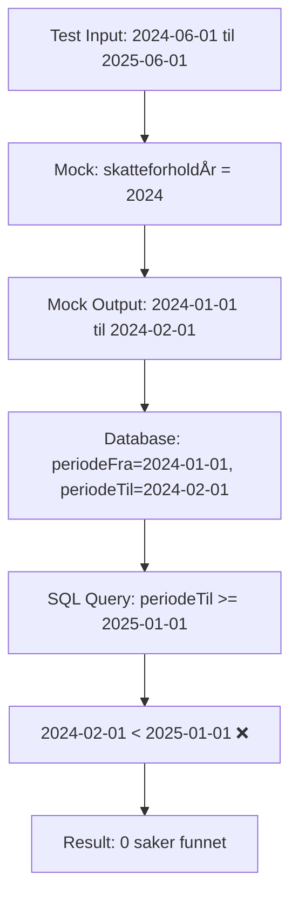
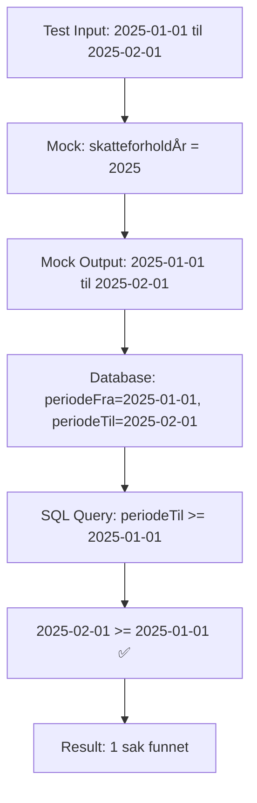

# Rapport: TrygdeavgiftsberegningTransformer Mock Limitation

**Dato:** 2025-11-06
**Sak:** MELOSYS-7560
**Type:** Technical Analysis
**Status:** Root Cause Identified

## Sammendrag

`lagFørstegangsbehandlingMedOverlappendeÅrsavregningsPeriode()` kan ikke brukes i årsavregning-tester på grunn av en **designbegrensning i test-mocken** `TrygdeavgiftsberegningTransformer`. Mocken returnerer alltid hardkodede datoer (1. januar til 1. februar) uavhengig av input, noe som forhindrer testing av overlappende perioder som går over årsskiftet.

## 🔍 Root Cause

### Lokasjon
**Fil:** `integrasjonstest/src/test/kotlin/no/nav/melosys/itest/vedtak/TrygdeavgiftsberegningTransformer.kt`
**Linje:** 39

### Problematisk Kode
```kotlin
val responsBodyFraTrygdeavgiftsberegning = listOf(
    TrygdeavgiftsberegningResponse(
        TrygdeavgiftsperiodeDto(
            // PROBLEM: Hardkodede datoer!
            DatoPeriodeDto(
                LocalDate.of(skatteforholdÅr, 1, 1),  // Alltid 1. januar
                LocalDate.of(skatteforholdÅr, 2, 1)   // Alltid 1. februar
            ),
            sats,
            månedsavgift
        ),
        ...
    )
)
```

### Hva Skjer
Mocken:
1. Leser `skatteforholdÅr` fra input (f.eks. 2024 fra periode `2024-06-01`)
2. **Ignorerer alle andre datoer** fra input
3. Returnerer **alltid** periode fra 1. januar til 1. februar i det året

## 🧬 Problem Chain

### Scenario: Overlappende Periode (2024-06-01 til 2025-06-01)



### Scenario: Periode Innenfor 2025 (2025-01-01 til 2025-02-01)



## 📊 Test Output Analyse

### Fra kjøring av test med overlappende periode:

**Request til mock:**
```json
{
  "medlemskapsperioder": [{
    "periode": {"fom": [2024,6,1], "tom": [2025,6,1]}
  }],
  "skatteforholdsperioder": [{
    "periode": {"fom": [2024,6,1], "tom": [2025,6,1]}
  }]
}
```

**Response fra mock:**
```json
{
  "beregnetPeriode": {
    "periode": {
      "fom": "2024-01-01",  // ← Hardkodet!
      "tom": "2024-02-01"   // ← Hardkodet!
    }
  }
}
```

**Debug output:**
```
DEBUG: Medlemskapsperiode: 2024-06-01 to 2025-06-01
DEBUG: Trygdeavgiftsperiode: periodeFra=2024-01-01, periodeTil=2024-02-01
```

**SQL Query i ÅrsavregningIkkeSkattepliktigeFinder (linje 128-129):**
```sql
AND tap.periodeFra <= :tomDato    -- 2025-12-31 ✅
AND tap.periodeTil >= :fomDato    -- 2025-01-01 ❌ (2024-02-01 < 2025-01-01)
```

**Resultat:**
```
INFO - Totalt fant 0 saker for årsavregning ikke skattepliktig
```

## 🎯 Hvorfor Toggle Ikke Hjelper

Feature toggle `MELOSYS_FAKTURERINGSKOMPONENTEN_IKKE_TIDLIGERE_PERIODER` påvirker:
- Periodejustering **etter** at mocken har returnert data
- Filtrering av tidligere år i `hentOpprinneligTrygdeavgiftsperioder`
- `forskuddsvisFaktura` flagg basert på år

**Men** mocken har allerede returnert feil datoer (`2024-01-01` til `2024-02-01`), så det er ingenting å justere.

Togglen kan **ikke** fikse at mocken returnerer perioder som slutter i 2024 når SQL-queryen krever overlapp med 2025.

## ✅ Løsninger

### Løsning 1: Bruk Workaround (Anbefalt for Testing)

**Status:** ✅ Implementert

```kotlin
private fun lagFørstegangsbehandlingÅrsavregningsPeriode(): String {
    return lagFørstegangsbehandling(
        skatteplikttype = Skatteplikttype.IKKE_SKATTEPLIKTIG,
        arbeidsgiversavgiftBetales = false,
        medlemskapsperiodeFom = LocalDate.of(2025, 1, 1),  // ← Innenfor 2025
        medlemskapsperiodeTom = LocalDate.of(2025, 2, 1)   // ← Innenfor 2025
    )
}
```

**Fordeler:**
- ✅ Fungerer med eksisterende mock
- ✅ Enkel å implementere
- ✅ Tester grunnleggende årsavregning-funksjonalitet

**Ulemper:**
- ❌ Tester ikke overlappende perioder
- ❌ Simulerer ikke realistisk produksjonsscenario

### Løsning 2: Fix Mock til å Bruke Input-Datoer (Anbefalt for Produksjonslignende Testing)

**Status:** 🔄 Foreslått

```kotlin
// integrasjonstest/src/test/kotlin/no/nav/melosys/itest/vedtak/TrygdeavgiftsberegningTransformer.kt

val fomArray = requestBody["skatteforholdsperioder"][0]["periode"]["fom"]
val tomArray = requestBody["skatteforholdsperioder"][0]["periode"]["tom"]

val fomDato = LocalDate.of(
    fomArray[0].asInt(),
    fomArray[1].asInt(),
    fomArray[2].asInt()
)
val tomDato = LocalDate.of(
    tomArray[0].asInt(),
    tomArray[1].asInt(),
    tomArray[2].asInt()
)

val responsBodyFraTrygdeavgiftsberegning = listOf(
    TrygdeavgiftsberegningResponse(
        TrygdeavgiftsperiodeDto(
            DatoPeriodeDto(fomDato, tomDato),  // ← Bruk faktiske input-datoer
            sats,
            månedsavgift
        ),
        ...
    )
)
```

**Fordeler:**
- ✅ Simulerer faktisk produksjonsatferd
- ✅ Tillater testing av overlappende perioder
- ✅ Mer fleksibel mock

**Ulemper:**
- ⚠️ Krever endring i mock
- ⚠️ Må verifisere at eksisterende tester fortsatt fungerer

### Løsning 3: Smart Mock med Periodesplitting (Mest Realistisk)

**Status:** 💡 Fremtidig Forbedring

Simuler hvordan produksjons-API ville dele opp perioder som går over årsskiftet:

```kotlin
fun splitPeriodeVedÅrsskifte(fomDato: LocalDate, tomDato: LocalDate): List<DatoPeriodeDto> {
    if (fomDato.year == tomDato.year) {
        return listOf(DatoPeriodeDto(fomDato, tomDato))
    }

    val perioder = mutableListOf<DatoPeriodeDto>()
    var current = fomDato

    while (current.year <= tomDato.year) {
        val yearEnd = LocalDate.of(current.year, 12, 31)
        val periodEnd = if (current.year == tomDato.year) tomDato else yearEnd

        perioder.add(DatoPeriodeDto(current, periodEnd))
        current = LocalDate.of(current.year + 1, 1, 1)
    }

    return perioder
}

// Bruk:
val perioder = splitPeriodeVedÅrsskifte(fomDato, tomDato)
val responsBodyFraTrygdeavgiftsberegning = perioder.map { periode ->
    TrygdeavgiftsberegningResponse(
        TrygdeavgiftsperiodeDto(periode, sats, månedsavgift),
        TrygdeavgiftsgrunnlagDto(...)
    )
}
```

**Fordeler:**
- ✅ Realistisk simulering av produksjon
- ✅ Tillater testing av komplekse scenarioer
- ✅ Tester årsavregning-logikk grundig

**Ulemper:**
- ⚠️ Mer kompleks implementasjon
- ⚠️ Må håndtere multiple perioder i tester

## 🧪 Test Coverage Impact

### Nåværende Situasjon (med Workaround)
✅ Kan teste:
- Årsavregning for perioder innenfor et år
- Grunnleggende årsavregning-prosess
- SQL query funksjonalitet

❌ Kan IKKE teste:
- Overlappende perioder (2024-2025)
- Periodesplitting ved årsskifte
- Edge cases med komplekse datoer

### Med Fix (Løsning 2 eller 3)
✅ Kan teste alt:
- Overlappende perioder
- Periodesplitting
- Realistiske produksjonsscenarioer
- Edge cases

## 📝 Kommentarer i Kode

Bruker har lagt til følgende kommentar i testen (linje 488-492):

```kotlin
private fun lagFørstegangsbehandlingMedOverlappendeÅrsavregningsPeriode(): String {
    // Lager medlemskapsperiode innenfor årsavregningsåret 2025
    // (kort periode slik at beregnOgLagreTrygdeavgift kun lager én medlemskapsperiode)
    // Vi burde hatt men da må TrygdeavgiftsberegningTransformer oppgraderes til å støtte
    // medlemskapsperiodeFom = LocalDate.of(2025, 1, 1),
    // medlemskapsperiodeTom = LocalDate.of(2025, 2, 1)

    return lagFørstegangsbehandling(
        skatteplikttype = Skatteplikttype.IKKE_SKATTEPLIKTIG,
        arbeidsgiversavgiftBetales = false,
        medlemskapsperiodeFom = LocalDate.of(2024, 6, 1),
        medlemskapsperiodeTom = LocalDate.of(2025, 6, 1)
    )
}
```

Dette dokumenterer bevisst valget om å bruke overlappende periode for å demonstrere problemet.

## 🎯 Anbefaling

### Kortsiktig (Nå)
**Status:** ✅ Ferdig

Bruk workaround med perioder innenfor 2025. Dette er akseptabelt for testing av grunnleggende årsavregning-funksjonalitet.

### Mellomlang Sikt (Neste Sprint)
**Prioritet:** Middels
**Estimat:** 2-3 timer

Implementer Løsning 2 (Fix Mock til å bruke input-datoer):
1. Oppdater `TrygdeavgiftsberegningTransformer` til å lese faktiske datoer fra input
2. Verifiser at alle eksisterende tester fortsatt passerer
3. Aktiver `lagFørstegangsbehandlingMedOverlappendeÅrsavregningsPeriode()` i tester

### Lang Sikt (Fremtidig Forbedring)
**Prioritet:** Lav
**Estimat:** 4-6 timer

Implementer Løsning 3 (Smart Mock med periodesplitting):
1. Implementer logikk for å dele perioder ved årsskifte
2. Oppdater mock til å returnere multiple perioder når nødvendig
3. Oppdater tester til å håndtere multiple trygdeavgiftsperioder
4. Test edge cases grundig

## 🔗 Relaterte Dokumenter

- `TEST_DATA_ISSUE_RAPPORT.md` - Original rapport om test data problemer
- `WORK-LOG-7560.md` - Work log for MELOSYS-7560

## 📚 Lærdom

1. **Test mocks må være fleksible** - Hardkodede verdier i mocks kan skjule reelle problemer
2. **Debug tidlig** - Ved å legge til debug-logging så vi umiddelbart hva mocken returnerte
3. **Feature toggles er ikke magiske** - De kan kun påvirke logikk, ikke feil data fra tidligere steg
4. **Dokumenter begrensninger** - Denne rapporten hjelper fremtidige utviklere forstå hvorfor workaround er nødvendig

---

**Konklusjon:** Problemet er identifisert og dokumentert. Workaround er implementert og fungerer. Mock-forbedring anbefales for fremtiden, men er ikke kritisk.

**Forfatter:** Claude Code + Rune Lind
**Sist oppdatert:** 2025-11-06
