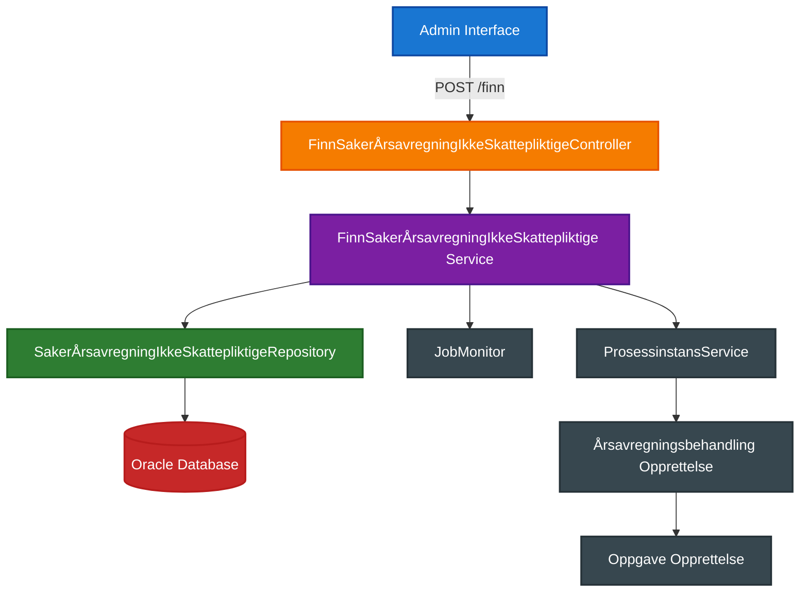
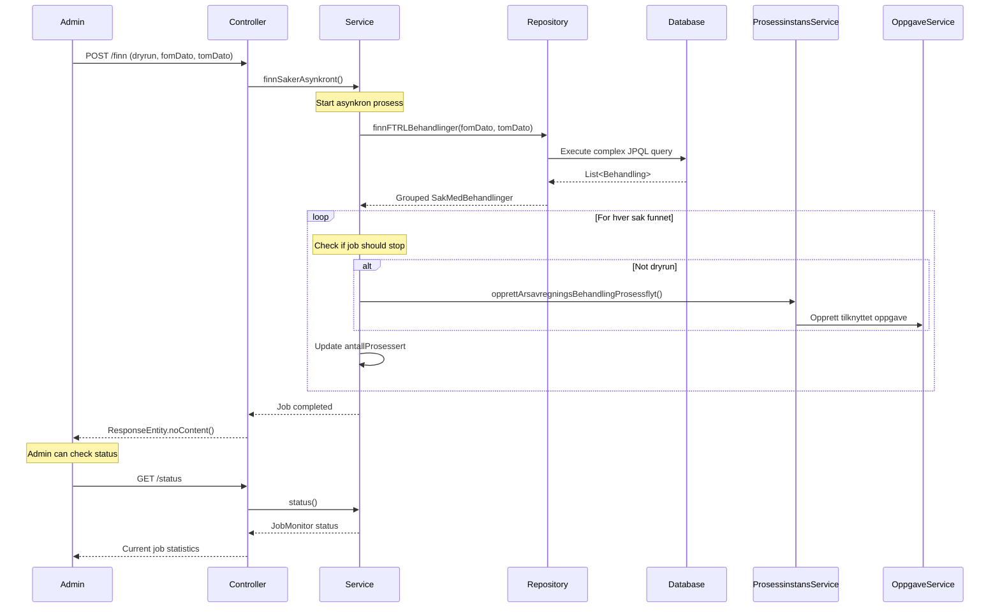

# Årsavregning for Ikke-Skattepliktige Saker - Løsningsdesign

## Oversikt

Dette dokumentet beskriver løsningen for automatisk opprettelse av årsavregningsbehandlinger for FTRL-saker hvor bruker ikke er skattepliktig til
Norge. Løsningen kompletterer det eksisterende systemet som håndterer skattepliktige saker basert på meldinger fra Skatteetaten.

## Bakgrunn

Melosys skal opprette årsavregningsbehandlinger ikke bare for skattepliktige brukere (når skatteoppgjør er ferdig), men også for:

- Brukere som ikke er skattepliktige til Norge

## Løsningsarkitektur

### Høynivå Arkitektur



### Komponentoversikt

#### 1. FinnSakerÅrsavregningIkkeSkattepliktigeController

- **Rolle**: REST API endpoint for admin-grensesnitt
- **Endepunkter**:
    - `POST /finn` - Starter søk etter saker
    - `GET /status` - Henter jobbstatus
    - `GET /jsonrapport` - Henter detaljert rapport

#### 2. FinnSakerÅrsavregningIkkeSkattepliktige Service

- **Rolle**: Hovedorkestrerer for søk og behandling
- **Nøkkelfunksjonalitet**:
    - Asynkron søk med `@Async("taskExecutor")`
    - Feilhåndtering med konfigurerbart antall feil før stopp
    - Dry-run modus for testing
    - JobMonitor for statusovervåkning

#### 3. SakerÅrsavregningIkkeSkattepliktigeRepository

- **Rolle**: Dataaccesslag
- **Query**: Kompleks JPQL-spørring som finner FTRL-saker med ikke-skattepliktige medlemskapsperioder

## Forretningslogikk

### Kriteria for Sakidentifikasjon

Systemet skal finne saker som oppfyller **alle** følgende kriterier:

```sql
-- Forenklet versjon av query logikk
SELECT DISTINCT b.*
FROM Behandlingsresultat br
         JOIN br.behandling b
         JOIN br.medlemskapsperioder mp
         JOIN br.vedtakMetadata vm
         JOIN b.fagsak f
         JOIN mp.trygdeavgiftsperioder tap
         JOIN tap.grunnlagSkatteforholdTilNorge stn
WHERE f.type = 'FTRL'
  AND mp.fom >= :fomDato
  AND mp.tom < :tomDato
  AND f.status = 'LOVVALG_AVKLART'
  AND stn.skatteplikttype = 'IKKE_SKATTEPLIKTIG'
```

### Detaljerte Forretningskrav

1. **Sakstype**: FTRL
2. **Saksstatus**: LOVVALG_AVKLART
3. **Behandling**:
    - Behandlingsresultat: MEDLEM_I_FOLKETRYGDEN
    - Siste vedtakstidspunkt
4. **Medlemskapsperiode**: Delvis eller helt overlapp med oppgitt år
5. **Skatteplikt**: "Ikke skattepliktig" for hele medlemskapsperioden
6. **Unntak**: Ikke saker med tidligere årsavregningsbehandling med resultat FASTSATT_TRYGDEAVGIFT

### Behandlingsopprettelse

For hver identifiserte sak skal det opprettes:

```kotlin
// Ny behandling med følgende egenskaper:
Behandling(
    type = ÅRSAVREGNING,
    tema = sisteBehandlingMedVedtak.tema, // Samme som siste behandling
    behandlingsårsak = AUTOMATISK_OPPRETTELSE,
)
```

### Oppgaveopprettelse

Hver ny behandling skal få tilknyttet oppgave med egenskaper fra [MELOSYS-6525]( https://jira.adeo.no/browse/MELOSYS-6525).
Dette skal skje automatisk med bruk av `prosessinstansService.opprettArsavregningsBehandlingProsessflyt`.

## Teknisk Implementering

### Asynkron Behandling

```kotlin
@Async("taskExecutor")
@Transactional(readOnly = true)
fun finnSakerAsynkront(
    dryrun: Boolean,
    antallFeilFørStopAvJob: Int,
    saksnummer: String?,
    fomDato: LocalDate,
    tomDato: LocalDate
)
```

### Feilhåndtering og Overvåkning

```kotlin
class JobMonitor(
    jobName: String,
    stats: JobStatus
) {
    // Håndterer feiltellingen og jobstopp
    // Gir detaljert status og timing-informasjon
}
```

### Status og Rapportering

```kotlin
inner class JobStatus : JobMonitor.Stats {
    @Volatile
    var antallFunnet: Int = 0
    @Volatile
    var antallProsessert: Int = 0
    @Volatile
    var dbQueryStoppedAt: LocalDateTime? = null

    override fun asMap(): Map<String, Any?> = mapOf(
        "dbQueryRuntime" to jobMonitor.durationUntil(dbQueryStoppedAt),
        "antallFunnet" to antallFunnet,
        "antallProsessert" to antallProsessert,
    )
}
```

## Dataflyt

### Prosessflyt Diagram



## Sikkerhet og Tilgangskontroll

- **Autentisering**: `@Protected` - krever gyldig token
- **Autorisasjon**: Admin-only endpoint (`/admin/ftrl/...`)
- **Transaksjonshåndtering**: `@Transactional(readOnly = true)` for datalesing

## Konfigurering og Parametre

### Request Parametre

| Parameter                | Type      | Default  | Beskrivelse                       |
|--------------------------|-----------|----------|-----------------------------------|
| `fomDato`                | LocalDate | Required | Start av medlemskapsperiode       |
| `tomDato`                | LocalDate | Required | Slutt av medlemskapsperiode       |
| `dryrun`                 | Boolean   | true     | Test-modus uten opprettelse       |
| `antallFeilFørStopAvJob` | Int       | 0        | Max feil før jobstopp             |
| `saksnummer`             | String    | null     | Spesifikk sak (ikke implementert) |

## Overvåkning og Logging

### Status Endepunkter

1. **GET /status**: Sanntidsstatus for pågående jobb
2. **GET /jsonrapport**: Detaljert rapport over funnet saker

## Utvidelsesmuligheter

### Planlagte Forbedringer

1. **TODO**: Bruk `prosessinstansService.opprettArsavregningsBehandlingProsessflyt` for faktisk opprettelse
2. **Saksnummer-filter**: Implementer støtte for spesifikk sak-parameter
3. **Grunnlag-replikering**: Automatisk kopiering av grunnlag fra siste behandling

## Testing

### Teststrategier

1. **Unit Tests**: Service-logikk og forretningsregler
2. **Integration Tests**: Database-spørringer og transaksjoner
3. **End-to-End Tests**: Komplett flyt fra API til behandlingsopprettelse

### Test-scenarios

- Dryrun-modus validering
- Jobb-stopp ved for mange feil
- Status-rapportering under kjøring

## Deployment og Drift

### Kode-organisering

```
service/src/main/kotlin/no/nav/melosys/service/ftrl/
├── FinnSakerÅrsavregningIkkeSkattepliktige.kt      # Hovedservice
├── FinnSakerÅrsavregningIkkeSkattepliktigeController.kt  # REST API
└── SakerÅrsavregningIkkeSkattepliktigeRepository.kt      # Data access
```

### Avhengigheter

- Spring Boot 3.3 (Jakarta EE)
- Jackson for JSON-serialisering
- Kotlin coroutines-support
- JPA/Hibernate for database-access

---

