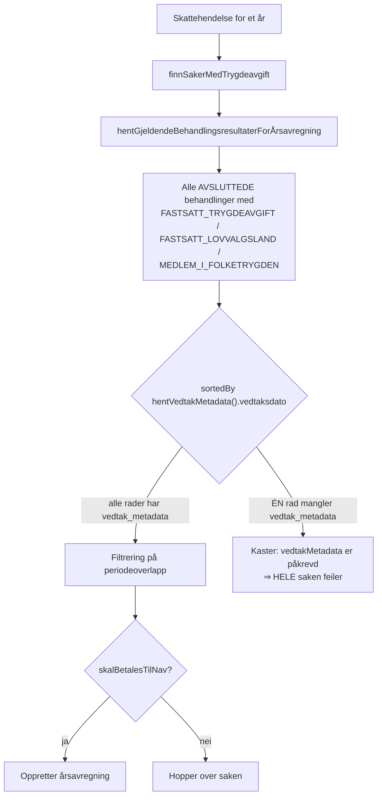

# MELOSYS-8174 — fiksplan for årsavregningssaker som mangler vedtaksmetadata

Bakgrunnsdokument for `VedtaksmetadataFiksService` og `VedtaksmetadataFiksController`.

Koden i denne pakka viser til **Q4a**, **Q4b** og **Q6a**. Det er nummereringen fra
arbeidsøkta med fag (Annette, 18.08.2026), der fiksen først ble kjørt som løse SQL-spørringer
mot prod. Endepunktene her gjør nøyaktig det samme som de spørringene — denne fila forklarer
hva numrene betyr, og hvorfor koden ser ut som den gjør.

Fullversjonen med prod-tall, kjøreplan og bonus-spørringer ligger i melosys-kode-wikien:
`archive/melosys-api-claude/2026-08-18-melosys-8174-fiksplan-4-saker`. Der finnes også
populasjonslister og beløp som ikke hører hjemme i et åpent repo.

---

## 1 · Hva som feiler

Feilmeldingen er `vedtakMetadata er påkrevd for Behandlingsresultat`, og den kommer fra
oppslaget som kjøres *før* saken vurderes for årsavregning:

```kotlin
// ÅrsavregningService.hentGjeldendeBehandlingsresultaterForÅrsavregning
val alleRelevanteBehandlinger = fagsak.behandlinger
    .filter { it.erAvsluttet() }
    .map { behandlingsresultatService.hentBehandlingsresultat(it.id) }
    .filter { it.type in behandlingsresultattyper }
    .filter { førVedtaksdato == null || it.hentVedtakMetadata().vedtaksdato < førVedtaksdato }
    .sortedBy { it.hentVedtakMetadata().vedtaksdato }   // <-- kaster hvis metadata mangler
```

`sortedBy` kaller `hentVedtakMetadata()` **ubetinget** på hver avsluttet behandling med
resultattype `FASTSATT_TRYGDEAVGIFT`, `FASTSATT_LOVVALGSLAND` eller `MEDLEM_I_FOLKETRYGDEN`.
Mangler *én* av dem raden i `vedtak_metadata`, velter hele saken — også når den defekte
behandlingen er fra et tidligere år og helt irrelevant for året som avregnes.



Feilen treffer altså i sorteringen, før noen faglig vurdering av perioder eller mottaker skjer.

Radene mangler fordi de stammer fra behandlinger avsluttet før vedtaksmetadata ble skrevet
konsekvent — samme klasse feil som Flyway-patchen
`V7.6_04__patch_vedtak_metadata_endret_periode.sql` ryddet i sin tid. Den ekte vedtaksdatoen
kan ikke rekonstrueres i etterkant; se seksjon 5.

---

## 2 · Q-nummereringen

| Nr | Hva den gjør | Endrer data | Finnes som kode her |
|---|---|---|---|
| **Q1** | Rotårsak per behandling for hele feilpopulasjonen — hvilke behandlingsresultat mangler raden. | Nei | Nei (analyse) |
| **Q2** | Én rad per sak: har saken i det hele tatt trygdeavgift for året? Viste at flertallet av feilene er ren støy. | Nei | Nei (analyse) |
| **Q3** | Avgiftsbildet per kandidatsak: skattepliktstype, inntektskilde og `aga_betales_til_skatt`. Brukes til å forutsi `skalBetalesTilNav`. | Nei | Nei (analyse) |
| **Q4a** | **Preview** — nøyaktig hvilke rader Q4b vil sette inn. | Nei | ✅ `forhaandsvis()` |
| **Q4b** | **Datafiksen** — setter inn de manglende radene. | **Ja** | ✅ `utfoer()` |
| **Q5** | Pre-sjekk av en enkeltsak med år-løs årsavregning. | Nei | Nei (analyse) |
| **Q6a** | Etterkontroll: hvor mange defekte rader står igjen per sak. Skal være tom etter en vellykket Q4b. | Nei | ✅ `utenMetadataPerSak` i svaret |
| **Q6b** | Etterkontroll: ble årsavregningene faktisk opprettet etterpå. | Nei | Nei (analyse) |
| **Q7 / Q8** | Undersøkelse av en år-løs `ÅRSAVREGNING`-behandling som *ikke* skyldes manglende vedtaksmetadata. Dokumenterer hvorfor den saken ble tatt ut av scope. | Nei | Nei (analyse) |

Q1–Q3, Q5, Q6b, Q7 og Q8 er read-only analysespørringer som hører til arbeidsøkta, ikke til
koden. De står i fullversjonen i wikien.

---

## 3 · Hvordan endepunktene kartlegger til Q-numrene

| Kall | Q | Metode | SQL-konstant |
|---|---|---|---|
| `POST …/vedtaksmetadata-fiks` med `skarp=false` (default) | Q4a | `forhaandsvis()` | `PREVIEW_SQL` |
| `POST …/vedtaksmetadata-fiks` med `skarp=true` | Q4b | `utfoer()` | `INSERT_SQL` |
| `utenMetadataPerSak` i svaret på begge | Q6a | `tellUtenMetadata()` | `ETTERKONTROLL_SQL` |
| `POST …/vedtaksmetadata-fiks/angre` | — | `angre()` | `ANGRE_SQL` |
| `sorteringspaavirkning` i svaret på begge | — | `sorteringspaavirkning()` | `EKSISTERENDE_NYESTE_SQL`, `PATCH_NYESTE_SQL` |

`PREVIEW_SQL` og `INSERT_SQL` deler `KANDIDAT_WHERE` i koden, nettopp for at forhåndsvisningen
skal treffe nøyaktig de samme radene som innsettingen. Sorteringsrapporten er ikke en del av
den opprinnelige Q-serien — den automatiserer krysssjekken fag gjorde for hånd (seksjon 4).

Full sti: `/admin/aarsavregninger/saker/skattepliktige/vedtaksmetadata-fiks`.

```bash
# Q4a — preview, read-only
curl -s -X POST "$MELOSYS_API/admin/aarsavregninger/saker/skattepliktige/vedtaksmetadata-fiks" \
  -H "Authorization: Bearer $MELOSYS_TOKEN" \
  -H "X-MELOSYS-ADMIN-APIKEY: $MELOSYS_ADMIN_APIKEY" \
  -H "Content-Type: application/json" \
  -d '{ "saksnummer": ["MEL-000000"], "skarp": false }'

# Q4b — datafiksen. Saksnummer er påkrevd ved skarp, og maksAntallRader må dekke antallet.
curl -s -X POST "$MELOSYS_API/admin/aarsavregninger/saker/skattepliktige/vedtaksmetadata-fiks" \
  -H "Authorization: Bearer $MELOSYS_TOKEN" \
  -H "X-MELOSYS-ADMIN-APIKEY: $MELOSYS_ADMIN_APIKEY" \
  -H "Content-Type: application/json" \
  -d '{ "saksnummer": ["MEL-000000"], "skarp": true, "maksAntallRader": 3 }'

# Angre — skarp=false er default, så du ser hva som ville blitt slettet først.
curl -s -X POST "$MELOSYS_API/admin/aarsavregninger/saker/skattepliktige/vedtaksmetadata-fiks/angre" \
  -H "Authorization: Bearer $MELOSYS_TOKEN" \
  -H "X-MELOSYS-ADMIN-APIKEY: $MELOSYS_ADMIN_APIKEY" \
  -H "Content-Type: application/json" \
  -d '{ "saksnummer": ["MEL-000000"], "skarp": true }'

# Nødbryter: rull tilbake ALT som er merket, uansett sak. Krever bekreftAlle, fordi et glemt
# "saksnummer" ellers ville slettet fikser fra tidligere kjøringer også.
curl -s -X POST "$MELOSYS_API/admin/aarsavregninger/saker/skattepliktige/vedtaksmetadata-fiks/angre" \
  -H "Authorization: Bearer $MELOSYS_TOKEN" \
  -H "X-MELOSYS-ADMIN-APIKEY: $MELOSYS_ADMIN_APIKEY" \
  -H "Content-Type: application/json" \
  -d '{ "skarp": true, "bekreftAlle": true }'
```

`tillatSorteringsendring` er en **liste med saksnummer**, ikke et av/på-flagg: kaprer én sak i et
kall med flere, skal ikke selen slås av for de øvrige.

### Feltene i svaret

| Felt | Betydning |
|---|---|
| `antallRaderFunnet` | Hvor mange rader treffer kandidatfilteret nå. |
| `antallRaderInnsatt` | 0 i preview. I skarp modus skal det være likt `antallRaderFunnet`; er det ikke det, settes `avvik` og tjenesten logger en advarsel. |
| `rader` | Samme kolonner som Q4a ga: behandlingsresultat-id, `beh_type`, resultattype, kommende vedtaksdato, klagefrist og vedtakstype. |
| `utenMetadataPerSak` | Q6a-etterkontrollen per sak, slik det står *nå*. I preview er den lik antall funne rader; etter en vellykket skarp kjøring skal den være tom. |
| `ukjentBehType` | Kandidater der vedtakstypen ikke kan utledes trygt. Er den ikke tom, avvises skarp kjøring. |
| `sorteringspaavirkning` | Per sak: bytter patchen ut hvilken behandling som er nyest i vedtaksdato-sorteringen. Se seksjon 5. Feltet `nyesteFoerErPatchet` sier om raden vi sammenligner mot selv ble satt inn av en tidligere kjøring — da er sammenligningen proxy mot proxy, og `patchenVinnerNyeste: false` er ikke et frikjenn. `ekteDatoer` inneholder kun datoer som faktisk stammer fra et vedtak. |
| `saksnummerUtenKandidater` | Saksnummer fra requesten som ikke ga én eneste kandidatrad — skrivefeil, eller sak uten defekte rader. Blokkerer ikke, men skal ses på når du trodde saken skulle fikses. |
| `avvik` | True hvis antall innsatte rader ikke stemmer med forhåndsvisningen — da beskriver `rader` kandidatene, ikke det som faktisk ble skrevet. |

---

## 4 · SQL-en Q4a/Q4b/Q6a ble kjørt som for hånd

Tatt med så en reviewer kan sammenligne koden mot det som faktisk ble kjørt mot prod.
Saksnummer er erstattet med en plassholder.

### Q4a — preview

```sql
SELECT b.saksnummer,
       br.behandling_id                         AS behandlingsresultat_id,
       b.beh_type,
       br.resultat_type,
       br.endret_dato                           AS blir_vedtak_dato,
       TRUNC(CAST(br.endret_dato AS DATE)) + 42 AS blir_klagefrist,
       CASE WHEN b.beh_type = 'FØRSTEGANG'
            THEN 'FØRSTEGANGSVEDTAK' ELSE 'ENDRINGSVEDTAK' END AS blir_vedtak_type
FROM behandling b
JOIN behandlingsresultat br ON br.behandling_id = b.id
WHERE b.status = 'AVSLUTTET'
  AND br.resultat_type IN ('FASTSATT_TRYGDEAVGIFT', 'FASTSATT_LOVVALGSLAND', 'MEDLEM_I_FOLKETRYGDEN')
  AND NOT EXISTS (SELECT 1 FROM vedtak_metadata vm WHERE vm.behandlingsresultat_id = br.behandling_id)
  AND b.saksnummer IN (:saksnummer)
ORDER BY b.saksnummer, br.endret_dato;
```

### Q4b — datafiksen

Idempotent via `NOT EXISTS`, så en utilsiktet ny kjøring gir null nye rader. Alle radene merkes
`MELOSYS-8174-PATCH` i `registrert_av`/`endret_av`, som er det som gjør fiksen reversibel.

```sql
INSERT INTO vedtak_metadata
    (behandlingsresultat_id, vedtak_dato, vedtak_klagefrist, vedtak_type,
     registrert_dato, endret_dato, registrert_av, endret_av)
SELECT br.behandling_id,
       br.endret_dato,
       TRUNC(CAST(br.endret_dato AS DATE)) + 42,
       CASE WHEN b.beh_type = 'FØRSTEGANG'
            THEN 'FØRSTEGANGSVEDTAK' ELSE 'ENDRINGSVEDTAK' END,
       SYSTIMESTAMP, SYSTIMESTAMP, 'MELOSYS-8174-PATCH', 'MELOSYS-8174-PATCH'
FROM behandling b
JOIN behandlingsresultat br ON br.behandling_id = b.id
WHERE b.status = 'AVSLUTTET'
  AND br.resultat_type IN ('FASTSATT_TRYGDEAVGIFT', 'FASTSATT_LOVVALGSLAND', 'MEDLEM_I_FOLKETRYGDEN')
  AND NOT EXISTS (SELECT 1 FROM vedtak_metadata vm WHERE vm.behandlingsresultat_id = br.behandling_id)
  AND b.saksnummer IN (:saksnummer);
```

`INSERT_SQL` i koden har i tillegg `AND br.behandling_id IN (:ider)`, bundet til ID-ene fra
forhåndsvisningen. Grunnen er at Oracle er READ COMMITTED: et statement som revaluerte
kandidatfilteret ville fått sitt eget snapshot, og kunne skrevet en kandidat som dukket opp
etter at sikkerhetsselene ble evaluert.

### Q6a — etterkontroll

Skal returnere null rader for de fiksede sakene.

```sql
SELECT b.saksnummer, COUNT(*) AS ant_uten_metadata
FROM behandling b
JOIN behandlingsresultat br ON br.behandling_id = b.id
WHERE b.status = 'AVSLUTTET'
  AND br.resultat_type IN ('FASTSATT_TRYGDEAVGIFT', 'FASTSATT_LOVVALGSLAND', 'MEDLEM_I_FOLKETRYGDEN')
  AND NOT EXISTS (SELECT 1 FROM vedtak_metadata vm WHERE vm.behandlingsresultat_id = br.behandling_id)
  AND b.saksnummer IN (:saksnummer)
GROUP BY b.saksnummer;
```

### Angreknappen

```sql
DELETE FROM vedtak_metadata
WHERE registrert_av = 'MELOSYS-8174-PATCH'
  AND endret_av = 'MELOSYS-8174-PATCH';
```

Begge kolonnene, ikke bare `registrert_av`: den er `@CreatedBy` og settes kun ved insert, så en
patch-rad som senere har fått en ekte vedtaksdato skrevet av en saksbehandler ville blitt
slettet med saksbehandlerens data. Slike rader telles i `antallEndretEtterpaa` og røres aldri.

`endret_av` er nullbar, og i Oracle er både `= 'MELOSYS-8174-PATCH'` og `<> 'MELOSYS-8174-PATCH'`
UNKNOWN mot NULL. Tellingen av rader som ikke kan rulles tilbake bruker derfor
`(endret_av IS NULL OR endret_av <> …)` — ellers ville en patch-rad med tømt `endret_av` falt ut
av både slettingen og tellingen, og svaret ville sett ut som «ingenting å angre».

Uskopet skarp angre krever `bekreftAlle=true`. Uten den selen ruller et `{"skarp": true}` der
`saksnummer` er glemt tilbake alle patch-rader i basen — også fra tidligere kjøringer — og hver
slettet rad gjeninnfører nøyaktig 8174-krasjen på saken den fikset.

---

## 5 · `vedtak_dato` er en proxy — og det er den viktigste forbeholden

Den ekte vedtaksdatoen finnes ikke lenger for disse radene. Fiksen bruker
`behandlingsresultat.endret_dato`, altså når resultatet ble ferdigstilt.

Det er ikke et harmløst valg. `ÅrsavregningService` sorterer på `vedtak_dato` og plukker den
siste som `sisteBehandlingsresultatMedAvgift` — altså behandlingen avgiftsgrunnlaget hentes
fra. `endret_dato` er `@LastModifiedDate` og dermed alltid ≥ ekte vedtaksdato, og den driver
videre for hver senere skriving på raden. Patchede rader ser derfor systematisk nyere ut enn de
er, mens radene som ikke patches beholder ekte dato — sorteringen sammenligner to ulike klokker.

Derfor rapporterer endepunktet `sorteringspaavirkning` per sak og **avviser skarp kjøring** når
patchen ville tatt nyeste-plassen, med mindre `tillatSorteringsendring=true` sendes bevisst.
I arbeidsøkta ble dette gjort for hånd, sak for sak; selen automatiserer den kontrollen.

To ting å merke seg om selen:

- Sammenligningen bruker mikrosekunder (`.FF6`). Uten dem svarer rapporten «patchen vinner
  ikke» når de to ligger i samme sekund — og `vedtak_dato` er en TIMESTAMP som
  `ÅrsavregningService` sammenligner i full oppløsning. Prod-dataene inneholder faktisk en sak
  der en ny vurdering ble gjort drøye tre minutter etter førstegangsvedtaket.
- `patchenVinnerNyeste: false` er **ikke** et frikjenn. Sammenligningen er global maks mot
  global maks, mens den ekte utvelgelsen først filtrerer på år og periodeoverlapp. Taper
  patchen mot en rad som årsfilteret luker bort, kan den fortsatt vinne der det teller. Derfor
  listes alle ekte-daterte rader i `ekteDatoer`, så operatøren kan se hva patchen faktisk slår.

Klagefrist (+42 dager) og vedtakstype er også rekonstruert, etter mønsteret fra `V7.6_04`.
Ingen av dem påvirker årsavregningen; de finnes for at raden skal være komplett.
`vedtak_type` er verdt en merknad: `beh_type` *bestemmer* ikke vedtakstypen — den sendes
separat i `FattVedtakRequest`, og kodeverket har også `KORRIGERT_VEDTAK`, `OMGJØRINGSVEDTAK` og
`OPPHØRSVEDTAK`. Utledningen er bevisst likevel, fordi feltet ikke leses av
`ÅrsavregningService`, `V7.6_04` gjorde samme utledning for en strukturelt lik populasjon, og
alternativet `NULL` er verre: `A1TypeUtstedelse.av()` switcher på enumen uten null-gren.
Behandlingstyper vi ikke kan utlede trygt (`KLAGE`, `ANKE`, `SATSENDRING` …) avvises i stedet.

---

## 6 · Omfang: hvorfor bare noen få saker, og hvorfor ikke kodefiksen

Tre alternativer ble vurdert i arbeidsøkta:

| Alternativ | Omfang | Vurdering |
|---|---|---|
| **A. Minimal** *(valgt)* | Kun sakene fag har bekreftet har trygdeavgift til Nav for året. | Løser sakene som faktisk blokkerer. De øvrige fortsetter å feile i hver kjøring — støy i rapporten, men ingen faglig konsekvens. |
| **B. Full** *(frarådet)* | Alle defekte rader i hele feilpopulasjonen. | Ville gjort fremtidige kjøringer rene, men Q2 viser at flere av de øvrige sakene også har trygdeavgiftsperioder i året, og vi har ikke AGA-flaggene deres. En full fiks kan derfor gi opprettelser i strid med fagvurderingen. |
| **C. Kodefiks** | Null-sikker `hentVedtakMetadata()` i filter/sortering. | Riktig langsiktig løsning, men fikser ikke dataene, og har åpen semantikk-risiko: å *hoppe over* en rad uten metadata kan endre hvilken behandling som blir «nyeste». |

A og C utelukker ikke hverandre. **C er ikke med i denne pakka** — den tas som egen endring
etter avklaring med fag. Endepunktene her er A.

En datafiks garanterer heller ikke opprettelse: etter at metadataen er på plass må saken
fortsatt ha trygdeavgiftsperioder som overlapper året *og* `skalBetalesTilNav`. Vedtak gjort
utenfor flyten kan mangle periodene helt i databasen — da hopper jobben over saken uansett, og
årsavregningen må opprettes manuelt i GUI via `ÅrsavregningController`.

Og ikke alle «vedtakMetadata er påkrevd»-saker er metadata-saker: minst én i populasjonen viste
seg å ha en år-løs `ÅRSAVREGNING`-behandling (ingen rad i `aarsavregning`). Metadata-fiksen
ville bare byttet feilmelding der. Q7/Q8 dokumenterer den undersøkelsen.

---

## 7 · Hvorfor endepunktet står permanent

Alternativet — å re-implementere fiksen på en ny ops-branch hver gang feilklassen dukker opp —
er dyrere og farligere enn å la den stå ferdig reviewet. `V7.6_04` var forrige runde av
nøyaktig dette. Endepunktet er idempotent, read-only som default, admin-autentisert
(`@Protected` + `X-MELOSYS-ADMIN-APIKEY` via `ApiKeyInterceptor` på `/admin/**`) og gjør
ingenting uten et eksplisitt kall med `skarp=true`.

Sikkerhetsselene, alle lagt til etter kodereview:

- Skarp krever eksplisitt saksnummer-liste; default-listen gjelder kun i preview.
- Maks 25 saksnummer per kall, og skarp avvises hvis den ville satt inn flere rader enn
  `maksAntallRader` (default 10).
- Over 1000 kandidatrader avvises uansett hva `maksAntallRader` er satt til: `INSERT_SQL` binder
  kandidat-IDene i `IN (:ider)`, og Oracle tar maks 1000 uttrykk i en IN-liste (ORA-01795). Del
  kjøringen opp i flere kall.
- Ukjent `beh_type` blokkerer.
- Sorteringsselen (seksjon 5), kvittert ut per saksnummer og ikke som av/på.
- Angre rører kun rader som fortsatt er urørt patch, og uskopet skarp angre krever `bekreftAlle`.
- Saksnummer valideres mot `MEL-<tall>` **og** bindes som JDBC-parameter.

Garantiene er pinnet i `integrasjonstest/…/VedtaksmetadataFiksIT.kt`, som kjører mot ekte
Oracle.

---

## Videre lesning

- Fullversjon med prod-tall og kjøreplan: melosys-kode-wiki,
  `archive/melosys-api-claude/2026-08-18-melosys-8174-fiksplan-4-saker`
- Review-historikk og ops-forbehold:
  `archive/melosys-api-claude/2026-08-24-melosys-8174-8045-status-etter-review`
- Jira: MELOSYS-8174 (denne), MELOSYS-8045 (skarp kjøring av skattepliktige årsavregninger)
